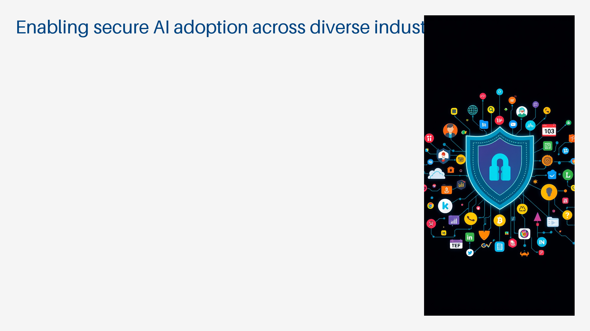
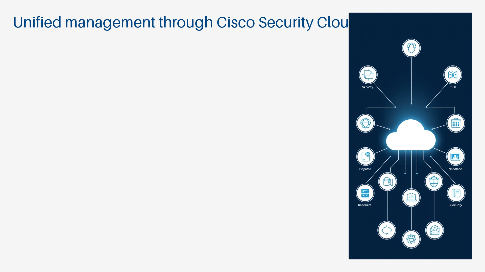

# Title: Title: Cisco Secure AI Factory Fundamentals

*Generated on 2025-10-19*

## Main Module

### Introduction to Secure AI Factories

### The Evolving Threat Landscape for AI

#### Increasing sophistication of AI-focused attacks.

#### AI systems as targets for data theft and manipulation.

#### AI systems as tools for orchestrating larger attacks.

#### New vulnerabilities introduced by AI development.

#### Need for proactive and intelligent security solutions.

#### Case studies of recent AI security incidents.

### Why Security is Paramount for AI Adoption

#### Building trust in AI technologies.

#### Protecting sensitive training data.

#### Ensuring AI model integrity and reliability.

#### Preventing unauthorized access and control of AI systems.

#### Meeting regulatory and compliance requirements.

#### Mitigating reputational damage from security breaches.

### Cisco Secure AI Factory with NVIDIA: Vision and Value Proposition

#### Integrated approach to AI infrastructure security.

#### Leveraging expert capabilities from Cisco and NVIDIA.

#### Simplifying deployment and management of AI security.

#### Enabling secure and scalable AI innovation.

#### Benefits of a unified security fabric for AI.

#### Roadmap and future direction of the Secure AI Factory.

### Key Use Cases and Industry Applications

#### Secure development and deployment of Generative AI.

#### Protecting sensitive data in AI-powered analytics.

#### Securing AI in critical infrastructure and industrial IoT.

#### Compliance and privacy for AI in healthcare and finance.

#### Enhancing cybersecurity with AI-driven threat intelligence.

#### Enabling secure AI adoption across diverse industries.

### Cisco Secure AI Factory Architecture

### Core Architectural Principles: Security at Every Layer

#### Defense-in-depth strategy for AI environments.

#### Zero Trust principles applied to AI infrastructure.

#### Policy-driven security automation.

#### Integration across applications, data, and infrastructure.

#### Distributed enforcement points for granular control.

#### Continuous monitoring and adaptation.

### Integration of Cisco Security Solutions (AI Defense, Hypershield, Firewalls)

#### Cisco AI Defense for application-level security.

#### Cisco Hypershield for pervasive infrastructure security.

#### Cisco Secure Firewall for network perimeter and internal segmentation.

#### Synergy between different Cisco security products.

#### Unified management through Cisco Security Cloud.

#### Role of each component in the overall AI security posture.

### NVIDIA AI Enterprise and BlueField DPUs in the Secure AI Factory

#### NVIDIA AI Enterprise as the core AI software platform.

#### BlueField DPUs for offloading and accelerating security functions.

#### DPUs enabling hardware-based security enforcement.

#### DPUs facilitating network segmentation and isolation.

#### Integration of NVIDIA's AI stack with Cisco's security fabric.

#### Benefits of DPU-accelerated security for AI workloads.

### Data Flow, Policy Enforcement, and Unified Management

#### Understanding data movement within the AI Factory.

#### Centralized policy definition and distribution.

#### Distributed policy enforcement mechanisms.

#### Real-time visibility into security events.

### Key architectural zones: data ingestion, model training, inference.

### Management plane, control plane, and data plane interactions.

### Deploying Secure AI Infrastructure

### Planning and Design Considerations for Secure AI Workloads

#### Identifying critical AI assets and data.

#### Defining security requirements based on AI use case.

#### Risk assessment and threat modeling for AI deployments.

#### Compliance requirements (data privacy, regulatory).

#### Scalability and performance considerations.

#### Choosing appropriate security controls for each layer.

### Ready-to-Deploy vs. Build-Your-Own Deployment Options

#### Pre-validated reference architectures.

#### Benefits of vendor-certified solutions.

#### Flexibility of customized deployments.

#### Factors influencing deployment choice.

#### Hybrid approaches combining pre-built and custom components.

#### Implementation strategies for different scales.

### Initial Setup and Configuration of Secure AI Factory Components

#### Hardware and software prerequisites.

#### Step-by-step installation guides.

#### Network connectivity and configuration.

#### Integration with existing IT infrastructure.

#### Initial security policy setup.

#### Verification of core functionalities.

### Network Segmentation and Zero Trust Principles for AI

#### Defining micro-segments for AI workloads.

#### Implementing least privilege access controls.

#### Continuous verification of identities and device posture.

#### Network isolation of sensitive AI components.

#### Secure communication channels between AI services.

#### Policy enforcement at the DPU and network levels.

### Securing the AI Application Lifecycle (Cisco AI Defense)

### AI Application Security Risks (Prompt Injection, Data Privacy, Toxicity)

#### Understanding prompt injection attacks.

#### Protecting sensitive data used or generated by AI.

#### Detecting and mitigating harmful or biased AI outputs (toxicity).

#### Model evasion and poisoning attacks.

#### Unauthorized access to AI models and APIs.

#### Supply chain risks in AI development.

### Integrating Cisco AI Defense into CI/CD Workflows

#### Securing the AI development pipeline.

#### Automated security checks during code commits.

#### Vulnerability scanning of AI models and dependencies.

#### Policy enforcement before deployment.

#### Continuous security monitoring of deployed applications.

#### DevSecOps integration for AI development.

### Automated Vulnerability Testing for AI Models

#### Static and dynamic analysis of AI code.

#### Fuzzing techniques for AI models.

#### Testing for common AI vulnerabilities (OWASP Top 10 LLM).

#### Detecting adversarial examples.

#### Policy-based testing against security requirements.

#### Reporting and remediation workflows.

### Runtime Security and Policy Enforcement for AI Applications

#### Real-time threat detection for AI services.

#### Enforcing security policies during AI inference.

#### Input validation and sanitization.

#### Output filtering and content moderation.

#### Access control and authentication for AI APIs.

#### Blocking malicious prompts and requests.

### Pervasive Infrastructure Security (Cisco Hypershield)

### Microsegmentation and Distributed Security Enforcement

#### Granular security policies for individual workloads.

#### Dynamic segmentation based on workload identity and context.

#### Enforcement at the host, network, and DPU levels.

#### Reducing the attack surface.

#### Preventing lateral movement of threats.

#### Achieving a Zero Trust posture for infrastructure.

### Hypershield Integration with NVIDIA BlueField DPUs

#### Offloading security functions to the DPU.

#### Hardware-accelerated encryption and decryption.

#### DPU-based network access control lists (ACLs).

#### Distributed intrusion detection and prevention.

#### Fabric-based policy enforcement across the data center.

#### Enhanced performance and reduced CPU overhead.

### Real-time Threat Detection at Network, Server, and Application Layers

#### Network Intrusion Detection/Prevention Systems (NIDS/NIPS).

#### Host-based Intrusion Detection Systems (HIDS).

#### Application-aware security monitoring.

#### Behavioral analysis for anomaly detection.

#### Integration with threat intelligence feeds.

#### Automated threat identification and alerting.

### Preventing Lateral Movement and Containing Threats

#### Isolating compromised workloads.

#### Enforcing strict communication policies between segments.

#### Rapid incident response capabilities.

#### Limiting the blast radius of security breaches.

#### Honeytokens and deception technologies.

#### Automated playbook execution for containment.

### Unified Security Management and Compliance

### Centralized Visibility and Control with Cisco Security Cloud

#### Single pane of glass for all security policies and events.

#### Unified dashboard for AI Factory security status.

#### Correlation of events across different security controls.

#### Streamlined policy management.

#### Real-time monitoring and alerting.

#### Integration with third-party security tools.

### Consistent Policy Enforcement Across Hybrid Environments

#### Applying uniform security policies from edge to cloud.

#### Ensuring consistent security posture regardless of location.

#### Policy orchestration for complex, distributed AI deployments.

#### Managing policies for on-premises, private cloud, and public cloud AI.

#### Automation of policy updates and enforcement.

#### Adapting policies to changing threat landscapes.

### Logging, Auditing, and Reporting for AI Security

#### Comprehensive logging of all security events.

#### Audit trails for policy changes and access.

#### Generating security reports for compliance and management.

#### Centralized log collection and analysis.

#### Customizable reporting templates.

#### Forensic analysis capabilities.

### Compliance with AI Security Standards (NIST, OWASP LLM Top 10, MITRE ATLAS)

#### Mapping security controls to NIST AI RMF.

#### Addressing OWASP Top 10 Large Language Model Application Security Risks.

#### Implementing defenses against MITRE ATLAS techniques.

#### Continuous compliance monitoring and validation.

#### Ensuring data privacy regulations (GDPR, CCPA) are met.

#### Preparing for AI-specific audits.

### Operationalizing Security for AI (MLSecOps)

### Integrating Security into MLOps Pipelines

#### Building security into every stage of the ML lifecycle.

#### Automated security testing of data, models, and code.

#### Secure model packaging and deployment.

#### Continuous security validation of running models.

#### Integrating security tools within MLOps platforms.

#### Collaboration between Data Scientists, ML Engineers, and Security Teams.

### Automated Remediation and Incident Response for AI Threats

#### Playbooks for common AI security incidents.

#### Automated blocking of malicious prompts or inputs.

#### Quarantine of compromised AI workloads.

#### Automated policy adjustments based on detected threats.

#### Integration with SIEM and SOAR platforms.

#### Orchestrated incident response workflows.

### Collaboration Between Security, AI, and DevOps Teams

#### Breaking down silos between development, operations, and security.

#### Shared understanding of AI risks and security needs.

#### Cross-functional training and awareness.

#### Establishing common goals and metrics.

#### Empowering teams with necessary security tools and knowledge.

#### Fostering a culture of security ownership.

### Best Practices for Secure AI Operations

#### Principle of least privilege for AI systems and personnel.

#### Regular security assessments and penetration testing.

#### Secure coding practices for AI development.

#### Strong authentication and access controls.

#### Data encryption at rest and in transit.

#### Continuous security monitoring and anomaly detection.

### Monitoring and Troubleshooting Secure AI Factory

### AI-Driven Monitoring and Predictive Analytics for Security

#### Using AI to analyze vast security data streams.

#### Proactive identification of potential threats and vulnerabilities.

#### Predictive maintenance for security infrastructure.

#### Anomaly detection in AI behavior and system performance.

#### Automated alerting based on advanced threat indicators.

#### Reducing alert fatigue through intelligent filtering.

### Analyzing Security Logs and Alerts from AI Workloads

#### Understanding the structure and content of AI security logs.

#### Key indicators of compromise in AI environments.

#### Correlating alerts from different security components.

#### Filtering noisy or irrelevant alerts.

#### Prioritizing alerts based on severity and impact.

#### Using dashboards for quick overview of security posture.

### Troubleshooting Security Policy Enforcement Issues

#### Common reasons for policy enforcement failures.

#### Utilizing diagnostic tools for policy validation.

#### Verifying network connectivity and DPU configurations.

#### Debugging access control list (ACL) issues.

#### Resolving conflicts between security policies.

#### Tracing policy application to specific workloads.

### Optimizing Security Performance and Resource Utilization

#### Monitoring the impact of security controls on AI performance.

#### Identifying performance bottlenecks caused by security features.

#### Tuning security policies for optimal balance between security and performance.

#### Efficient use of DPU resources for security tasks.

#### Right-sizing security configurations.

#### Capacity planning for security infrastructure.

