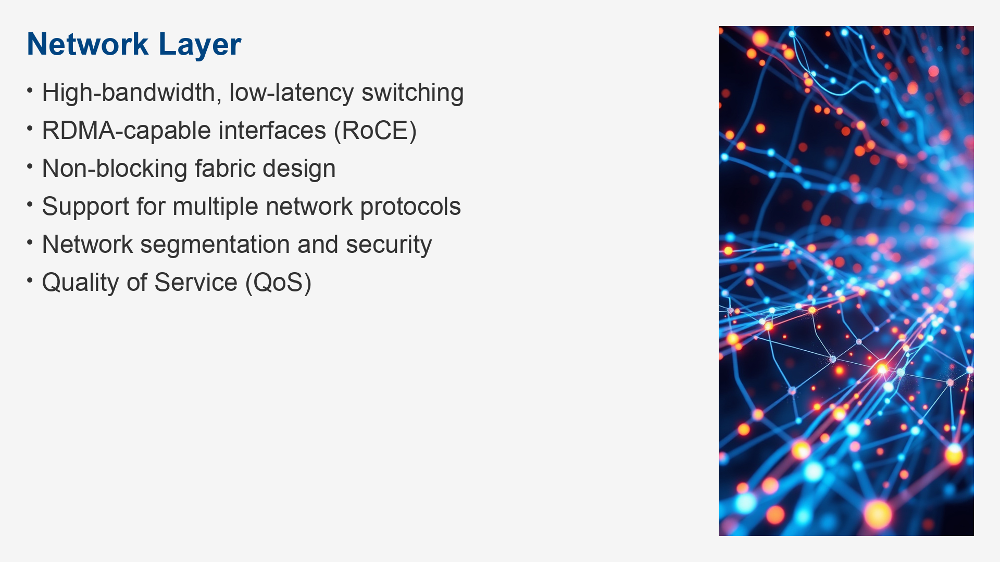
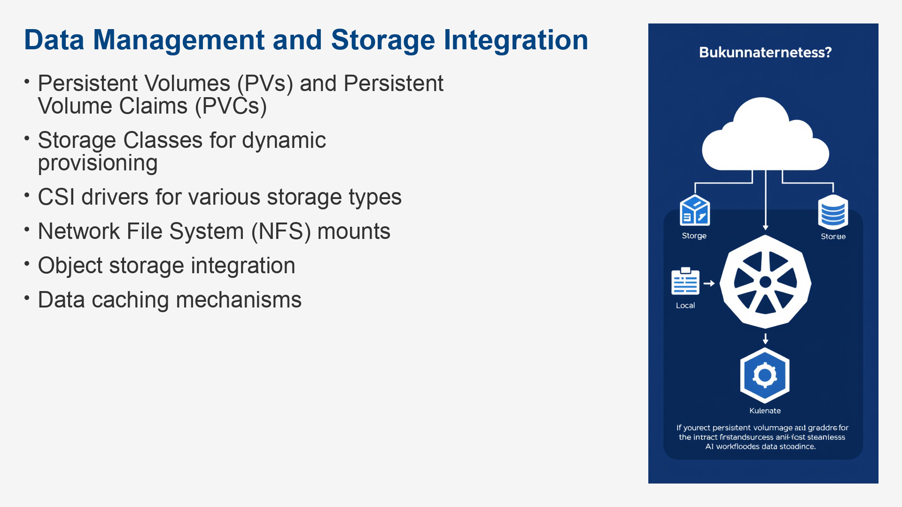

# Title: Title: Cisco HyperFabric for AI Fundamentals

*Generated on 2025-07-09*

## 1: Introduction to Cisco HyperFabric for AI

### The AI/ML Infrastructure Challenge

#### Growing Demand for AI/ML

- Exponential data growth
- Increased model complexity
- Need for rapid iteration
- Scalability requirements
- Performance demands
- Cost pressures

#### Infrastructure Bottlenecks

- Compute limitations
- Network congestion
- Storage throughput issues
- Complex management
- Lack of specialized solutions
- Integration difficulties

#### Impact on AI/ML Projects

- Delayed project timelines
- Inefficient resource utilization
- Increased operational costs
- Difficulty in scaling
- Suboptimal model performance
- Hindered innovation

### Cisco's Approach to AI/ML Infrastructure

#### Integrated Solutions

- Holistic approach
- End-to-end lifecycle support
- Simplified deployment
- Optimized integration
- Reduced complexity
- Streamlined operations

#### Performance and Scalability

- High-speed networking
- GPU acceleration
- Scalable storage
- Efficient resource management
- Elastic capacity
- Future-proofing

#### Operational Simplicity

- Unified management
- Automation capabilities
- Simplified monitoring
- Proactive troubleshooting
- Reduced human error
- Faster time to deployment

### Cisco HyperFabric for AI Overview and Value Proposition

#### What is Cisco HyperFabric for AI?

- Integrated hardware and software
- Designed for AI/ML workloads
- End-to-end acceleration
- Built on modern technologies
- Simplified deployment and management
- Optimized for performance

#### Key Value Drivers

- Accelerate AI/ML development
- Improve model training times
- Enhance operational efficiency
- Reduce infrastructure complexity
- Increase ROI on AI investments
- Support larger and more complex models

#### Target Use Cases

- Large Language Model (LLM) training
- Computer Vision model development
- Natural Language Processing (NLP)
- Recommendation systems
- Time-series forecasting
- Generative AI applications

### Key Use Cases and Business Benefits

#### Accelerating AI Model Training

- Faster iteration cycles
- Reduced time to insight
- Ability to train larger models
- Improved accuracy through more data
- Efficient GPU utilization
- Lower training costs

#### Enhancing AI Inference Performance

- Lower latency for real-time applications
- Higher throughput for batch inference
- Consistent performance under load
- Scalable inference infrastructure
- Support for edge AI deployment
- Improved user experience

#### Streamlining MLOps Pipelines

- Simplified deployment of ML models
- Automated model retraining
- Centralized monitoring of ML workloads
- Version control for models and data
- Faster integration of new models
- Improved collaboration between teams

#### Operational Efficiency and Cost Savings

- Reduced infrastructure management overhead
- Optimized resource utilization
- Lower power consumption
- Simplified procurement and deployment
- Predictable operational expenses
- Faster problem resolution

## 2: Cisco HyperFabric for AI Architecture

### Core Components (Compute, Network, Storage)

#### Compute Layer

- GPU-accelerated servers
- CPU options for data pre-processing
- Memory and local storage
- High-speed interconnects
- Scalable compute nodes
- Integration with Kubernetes

#### Network Layer

- High-bandwidth, low-latency switching
- RDMA-capable interfaces (RoCE)
- Non-blocking fabric design
- Support for multiple network protocols
- Network segmentation and security
- Quality of Service (QoS)

#### Storage Layer

- High-performance parallel file systems
- NVMe-based storage options
- Distributed storage architecture
- High throughput and IOPS
- Data resilience and availability
- Scalability of storage capacity

#### Management and Orchestration

- Centralized управление panel
- Kubernetes-based orchestration
- Infrastructure provisioning tools
- Monitoring and logging services
- Policy-based management
- API-driven automation

### Integration with NVIDIA AI Enterprise

#### NVIDIA AI Enterprise Suite

- Comprehensive AI/ML software stack
- Optimized for NVIDIA hardware
- Includes frameworks and libraries
- Support for containerized AI workloads
- Enterprise-grade support and security
- Enables easier adoption of AI

#### Key Components of NVAIE

- NVIDIA GPU drivers
- CUDA Toolkit
- cuDNN, TensorRT, NCCL
- NGC Catalog
- RAPIDS suite
- Triton Inference Server

#### Benefits of Integration

- Seamless deployment of NVAIE
- Optimized performance out-of-the-box
- Simplified management of AI software
- Access to the latest AI technologies
- Unified support from Cisco and NVIDIA
- Accelerated AI workflow development

### Software Stack Overview (Kubernetes, AI/ML Frameworks)

#### Operating System and Containerization

- Linux-based operating system
- Container runtime (e.g., containerd, Docker)
- Container networking interface (CNI)
- Image registry integration
- Security considerations for containers
- Efficient resource isolation

#### Kubernetes for Orchestration

- Pods, Deployments, Services
- StatefulSets for persistent storage
- DaemonSets for node-level agents
- Operators for managing complex applications
- Horizontal Pod Autoscaling (HPA)
- Cluster API for infrastructure management

#### AI/ML Frameworks Support

- TensorFlow and PyTorch support
- Support for popular libraries (Scikit-learn, XGBoost)
- Integration with data processing tools
- GPU scheduling and resource requests
- Optimized library builds
- Pre-built container images

#### Data Management and Storage Integration

- Persistent Volumes (PVs) and Persistent Volume Claims (PVCs)
- Storage Classes for dynamic provisioning
- CSI drivers for various storage types
- Network File System (NFS) mounts
- Object storage integration
- Data caching mechanisms

### Data Flow and Connectivity within HyperFabric

#### Data Ingestion Path

- Sources of training data
- Data transfer protocols
- Data loading and pre-processing stages
- Data validation and cleaning
- Pre-fetching data for GPUs
- Storage access patterns

#### Training Data Flow

- Data accessed from distributed storage
- Efficient data loading into GPU memory
- Network impact on data transfer speed
- Data augmentation pipelines
- Checkpointing and model saving
- Multi-node, multi-GPU communication

#### Model Inference Data Flow

- Data fed to inference servers
- Low latency requirements
- Real-time data streams
- Batch inference processing
- Networked access to models
- Output data handling

#### Inter-Component Communication

- Communication between Kubernetes pods
- GPU-to-GPU communication (e.g., NCCL)
- Data movement between compute and storage
- Network fabric utilized for all traffic
- Management plane to worker node communication
- API calls for orchestration

## 3: Deploying Cisco HyperFabric for AI

### Planning and Sizing for AI Workloads

#### Understanding Workload Requirements

- Model architecture and size
- Dataset size and characteristics
- Training vs. inference needs
- Performance targets (e.g., throughput, latency)
- Power and cooling requirements
- Budget constraints

#### Compute Resource Planning

- Number and type of GPUs required
- CPU core counts and speed
- RAM per node
- Interconnect bandwidth (e.g., NVLink, PCIe)
- GPU memory requirements
- GPU utilization targets

#### Network Resource Planning

- Bandwidth per node
- Latency targets
- RoCE configuration requirements
- Network topology considerations
- Switch fabric capacity
- Reliability and redundancy needs

#### Storage Resource Planning

- Storage capacity needed
- IOPS and throughput requirements
- Data access patterns
- File system performance characteristics
- Data retention policies
- Backup and disaster recovery strategy

#### Sizing Tools and Methodologies

- Cisco's sizing guides
- NVIDIA's best practices
- Benchmarking existing workloads
- Proof of Concept (PoC) testing
- Capacity planning models
- Simulation tools

### Installation and Initial Setup

#### Pre-installation Checklist

- Hardware requirements verification
- Network connectivity setup
- IP addressing and DNS configuration
- Software prerequisites
- User account and permissions
- Firmware updates

#### Hardware Installation

- Server rack mounting
- Cabling (network, power)
- Component verification (NICs, GPUs)
- BIOS/UEFI configuration
- Management interface setup
- Initial power-on

#### Software Installation

- Operating system deployment
- Driver installation (GPU, network)
- Kubernetes cluster installation
- CSI driver installation
- NVIDIA AI Enterprise deployment
- HyperFabric specific software installation

#### Initial Configuration

- Network fabric configuration
- Storage cluster setup
- Kubernetes cluster configuration
- Management node setup
- User authentication and authorization
- Security policy enforcement

### Network and Storage Configuration Best Practices

#### Network Configuration

- VLAN assignments for traffic isolation
- MTU settings for high performance
- RoCE configuration (PFC, ECN)
- QoS policies implementation
- Link aggregation (LAG) for bandwidth
- Network security group policies

#### Storage Configuration

- File system tuning parameters
- Mount options for performance
- Access control lists (ACLs)
- Data distribution strategies
- Cache configurations
- Storage provisioning methods

#### Kubernetes Storage Integration

- Dynamic provisioning using StorageClasses
- PersistentVolumeClaims for applications
- CSI driver configuration best practices
- Volume snapshots for backups
- Storage capacity management
- Performance monitoring of storage mounts

#### Security Considerations

- Network access control lists (ACLs)
- Role-based access control (RBAC) for Kubernetes
- Encryption of data at rest and in transit
- Secure API endpoints
- Regular security audits
- Vulnerability patching

### Validated Designs and Reference Architectures

#### Cisco Validated Designs (CVDs)

- Specific configurations tested by Cisco
- Performance benchmarks and guidelines
- Deployment steps and best practices
- Interoperability testing results
- Scalability limits and recommendations
- Troubleshooting guides

#### Reference Architectures

- Common deployment patterns
- Building blocks for different scales
- Modular design principles
- Options for specific AI/ML use cases
- Integration with existing datacenter infrastructure
- Future expansion possibilities

#### GPU Placement and Connectivity

- Optimizing GPU adjacency
- High-speed interconnects (NVLink, PCIe)
- Network interface card (NIC) selection
- Direct GPU-to-GPU communication paths
- Balancing GPU density and airflow
- Impact of topology on communication latency

#### Storage Connectivity

- High-speed network connections to storage
- Protocol choices (e.g., NFS, S3, Lustre)
- Minimize data hops
- Consistent performance across nodes
- Replication and redundancy for data
- Tiered storage solutions

## 4: Compute and GPU Management

### NVIDIA GPU Integration and Management

#### GPU Hardware Overview

- GPU architectures (Ampere, Hopper, etc.)
- GPU memory types and capacities
- High-speed interconnects (NVLink, PCIe)
- Tensor Cores for AI acceleration
- MIG (Multi-Instance GPU) capabilities
- Power and thermal considerations

#### GPU Driver Installation and Configuration

- Installing NVIDIA drivers
- Driver version compatibility
- CUDA Toolkit installation
- NVIDIA Container Toolkit
- GPU monitoring tools (nvidia-smi)
- Driver security updates

#### Managing GPUs with Kubernetes

- GPU device plugin for Kubernetes
- Requesting GPUs in Pod specifications
- Resource limits and quality of service classes
- Node labels for GPU types
- GPU sharing with MIG
- GPU monitoring within Kubernetes

#### GPU Performance Tuning

- Optimizing memory bandwidth usage
- Batch size tuning
- Kernel optimization
- Utilizing Tensor Cores effectively
- Minimizing data transfer overhead
- Power management settings

### Kubernetes for Container Orchestration

#### Core Kubernetes Concepts

- Control Plane components (API Server, ETCD, Scheduler)
- Worker Nodes (Kubelet, Kube-proxy, Container Runtime)
- Pods, Services, Deployments
- Networking model (CNI)
- Storage volumes and persistent data
- Configuration management (ConfigMaps, Secrets)

#### Deploying AI/ML Workloads on Kubernetes

- Containerizing AI applications
- Creating Kubernetes manifests (YAML files)
- Managing dependencies
- Resource requests and limits
- GPU resource allocation
- Job and Batch processing

#### StatefulSets for AI Services

- Managing stateful applications (databases, ML serving)
- Stable network identities
- Ordered deployment and scaling
- Persistent storage for stateful data
- Headless services for discovery
- Pod lifecycle management

#### Kubernetes Operators for AI

- Automating complex application management
- Defining custom resources (CRDs)
- Operator pattern for lifecycle management
- Managing distributed AI training jobs
- Simplifying deployment of ML platforms
- Self-healing capabilities

### Resource Allocation and Scheduling for AI/ML

#### Kubernetes Scheduler Deep Dive

- Scheduling process (predicates, priorities)
- GPU-aware scheduling
- Resource quotas and limits
- Affinity and anti-affinity rules
- Taints and tolerations
- Node selectors

#### Allocating GPU Resources

- GPU sharing mechanisms (MIG)
- Specifying GPU counts in Pods
- Node Feature Discovery for GPUs
- Fair-share scheduling for GPUs
- Dedicated GPU nodes
- Monitoring GPU utilization

#### CPU and Memory Allocation

- Setting CPU requests and limits
- Setting memory requests and limits
- Avoiding OOMKilled events
- Resource allocation for data pre-processing
- Supporting distributed training communication
- Managing cluster-wide resource allocation

#### Network Resource Allocation

- Network policy enforcement
- Bandwidth guarantees for critical traffic
- Prioritizing inter-GPU communication
- Load balancing across inference instances
- Network isolation for security
- QoS classes for network traffic

### Performance Tuning for Compute Resources

#### GPU Optimization Techniques

- Mixed-precision training
- Gradient accumulation
- Data loading optimization
- Utilizing libraries like NCCL and cuDNN
- Efficient use of GPU memory
- Profiling GPU utilization

#### CPU Optimization

- Offloading data pre-processing to CPU
- Efficient multi-threading
- Reducing context switching
- Tuning system parameters
- Optimizing data deserialization
- Parallel data loading

#### Memory Bandwidth Optimization

- Minimizing data movement
- Efficient data structures
- Cache utilization
- NUMA awareness
- Using high-bandwidth memory
- GPU memory controller tuning

#### Kernel and Operator Tuning

- Optimizing AI framework kernels
- Custom CUDA kernel development
- Using TensorRT for inference optimization
- Hyperparameter tuning for workloads
- Operator configuration optimization
- Fine-tuning AI model parameters

## 5: Network Optimization for AI

### High-Performance Networking (e.g., InfiniBand, Ethernet)

#### Evolution of High-Performance Networks

- Early networking limitations
- Rise of specialized interconnects
- Ethernet's evolution for data centers
- InfiniBand's dominance in HPC
- Convergence of networking technologies
- Impact of AI on network requirements

#### Ethernet for AI Workloads

- 100GbE, 200GbE, 400GbE speeds
- RoCE (RDMA over Converged Ethernet)
- DCB (Data Center Bridging) for lossless Ethernet
- Congestion control mechanisms (PFC, ECN)
- NIC offloads
- Benefits of Ethernet for cost and ubiquity

#### InfiniBand Technology

- Lower latency and higher bandwidth
- Native RDMA capabilities
- GPUDirect RDMA support
- Lossless fabric design
- Support for various interconnects (QSFP, OSFP)
- Specialized management tools

#### Choosing the Right Network Technology

- Benchmarking against AI workloads
- Cost considerations
- Existing infrastructure compatibility
- Management complexity
- Vendor support and ecosystem
- Future scalability needs

### Network Fabric Design for AI/ML Traffic

#### Topologies for AI Fabrics

- Leaf-Spine architecture
- Dragonfly topology
- Fat-tree designs
- All-to-all connectivity
- Impact of topology on bisection bandwidth
- Considerations for scale-out

#### Bisection Bandwidth Requirements

- Defining bisection bandwidth
- GPU-to-GPU communication needs
- Data sharing between nodes
- Impact on distributed training performance
- Calculating required bandwidth
- Over-subscription ratios

#### Lossless Networking

- Importance for RDMA and AI workloads
- PFC (Priority Flow Control) configuration
- ECN (Explicit Congestion Notification)
- Buffer management on switches
- QoS policies for traffic prioritization
- Link-level flow control

#### Network Segmentation and Isolation

- VLANs for logical separation
- VXLAN for overlay networking
- Network Access Control Lists (ACLs)
- Security groups in cloud environments
- Isolating management traffic
- Protecting AI workloads from interference

### RDMA over Converged Ethernet (RoCE)

#### Understanding RDMA

- Remote Direct Memory Access
- Zero-copy data transfer
- Kernel bypass
- Reduced CPU overhead
- Low latency communication
- Offloading network processing

#### RoCE v1 vs. RoCE v2

- RoCE v1: Layer 2 only
- RoCE v2: Layer 3 (UDP/IP) routing
- Advantages of RoCE v2 for scalability
- Use of UDP port 4791
- Need for lossless fabric with RoCE
- Router awareness for RoCE v2

#### Configuring RoCE

- Enabling PFC on switches and NICs
- Configuring ECN on switches and NICs
- NIC driver settings for RoCE
- Verifying RoCE connectivity
- Troubleshooting RoCE issues
- Tuning RoCE parameters

#### Benefits of RoCE for AI

- Faster inter-GPU communication
- Improved distributed training performance
- Efficient data loading from storage
- Reduced network latency for inference
- Higher overall system throughput
- Efficient utilization of network resources

### Network Monitoring and Troubleshooting

#### Key Network Metrics for AI

- Bandwidth utilization (Gbps)
- Packet loss percentage
- Latency (round-trip time)
- Jitter
- Congestion indicators (e.g., ECN drops)
- RoCE queue depth utilization

#### Monitoring Tools and Techniques

- SNMP for switch statistics
- Telemetry streaming (gNMI, Netconf)
- Network performance monitoring (NPM) tools
- Packet capture and analysis (Wireshark)
- Application Performance Monitoring (APM) for network flows
- Kubernetes network monitoring plugins

#### Troubleshooting Common Network Issues

- Identifying packet loss sources
- Diagnosing high latency
- Resolving congestion problems
- Verifying RoCE configuration
- Diagnosing incorrect MTU settings
- Troubleshooting network connectivity problems

#### Network Health and Best Practices

- Regularly monitor link status
- Maintain updated network drivers and firmware
- Implement robust monitoring and alerting
- Perform periodic network health checks
- Document network configurations
- Stress test network under load

## 6: Storage Solutions for AI

### High-Performance Storage for AI/ML Data

#### Storage Needs for AI/ML

- Large datasets
- High read/write throughput
- Low latency access
- Concurrent access by many nodes
- Data integrity and durability
- Scalability of capacity and performance

#### Parallel File Systems

- Lustre, BeeGFS, GPFS (Spectrum Scale)
- Distributed metadata servers
- Object-based storage targets (OSTs)
- Striping for performance
- High concurrency
- POSIX compliance

#### Object Storage

- Scalability and durability
- S3 API compatibility
- Use for unstructured data
- Integration with data lakes
- Potential latency challenges for some AI tasks
- Application-specific object access

#### NVMe-based Storage

- Lowest latency storage medium
- High IOPS performance
- Direct attached vs. networked NVMe
- Considerations for cost and density
- NVMe-oF (NVMe over Fabrics)
- Use for caching or staging data

### Data Management and Lifecycle

#### Data Ingestion and Loading

- Efficient data pipelines
- Pre-fetching and caching strategies
- Data validation during ingestion
- Handling diverse data formats
- Streaming data sources
- Parallel data loading techniques

#### Feature Engineering and Preprocessing

- Transformation of raw data
- Creating training features
- Impact of storage performance on these steps
- Versioning of feature sets
- Data quality checks
- Storage requirements for intermediate data

#### Data Archiving and Tiering

- Policies for data retention
- Moving inactive data to lower-cost storage
- Cold storage solutions
- Metadata management for archived data
- Data retrieval processes
- Compliance requirements

#### Data Deletion and Governance

- Securely deleting sensitive data
- Compliance with regulations (e.g., GDPR)
- Data lineage tracking
- Audit trails for data access
- Data minimization principles
- Managing data lifecycle policies

### Integration with Distributed File Systems

#### Configuring File System Mounts

- Client installation and configuration
- Mounting file systems on Kubernetes nodes
- Using CSI drivers for dynamic mounting
- Automounting on Pod startup
- Permissions and user mapping
- Performance tuning of mount options

#### Data Access Patterns

- Read-heavy workloads
- Write-heavy workloads
- Read-write patterns
- Sequential vs. random access
- Importance of metadata operations
- Impact of I/O patterns on performance

#### Performance Tuning of File Systems

- Tuning client-side parameters
- Optimizing server-side configurations
- Adjusting stripe counts and sizes
- Cache configuration
- Network tuning for storage traffic
- Monitoring I/O performance

#### Managing Large Datasets

- Efficient directory structures
- Using data sharding techniques
- Data compression
- Data partitioning strategies
- Metadata performance optimization
- Strategies for dataset versioning

### Data Security and Access Control

#### Authentication Methods

- Kerberos integration
- LDAP/Active Directory integration
- Service accounts
- API keys for object storage
- Mutual TLS (mTLS) for network traffic
- User mapping and identity management

#### Authorization Mechanisms

- POSIX permissions (UID/GID)
- Access Control Lists (ACLs)
- Role-Based Access Control (RBAC) in Kubernetes
- Object storage bucket policies
- Fine-grained access control
- Delegation of permissions

#### Data Encryption

- Encryption at rest (SEDs, software encryption)
- Encryption in transit (TLS/SSL)
- Key management practices
- Performance impact of encryption
- Hardware acceleration for encryption
- Secure key storage

#### Auditing and Compliance

- Logging all data access events
- Audit log retention policies
- Compliance with industry regulations
- Regular security audits
- Data masking for sensitive information
- Incident response planning

## 7: Managing AI/ML Workflows on HyperFabric

### Deploying AI/ML Applications

#### Containerizing AI/ML Applications

- Dockerfiles for AI environments
- Base images for popular frameworks
- Including necessary libraries and dependencies
- Optimizing container image size
- Reproducibility of environments
- Best practices for security scanning

#### Kubernetes Manifests for AI Workloads

- Deployments for stateless services
- Jobs for batch processing
- StatefulSets for persistent AI services
- ConfigMaps and Secrets for configuration
- Resource requests and limits (CPU, memory, GPU)
- Persistent Volume Claims for data

#### Using the NGC Catalog

- Accessing pre-trained models
- Finding optimized AI software containers
- Pulling images from the catalog
- Building custom containers based on NGC images
- Integration with Kubernetes registries
- Licensing and usage terms

#### Orchestrating Distributed Training Jobs

- Using Kubernetes operators for training
- Managing distributed training frameworks (e.g., Horovod, PyTorch DDP)
- Pod anti-affinity for node distribution
- Leader election for distributed tasks
- Coordinating multiple training instances
- Checkpointing and fault tolerance

### MLOps Concepts and Tools on HyperFabric

#### Introduction to MLOps

- Bridging Development and Operations for ML
- Automation of ML lifecycle
- Collaboration between data scientists and engineers
- Continuous Integration/Continuous Delivery (CI/CD) for ML
- Monitoring and management of ML models in production
- Reproducibility and governance

#### Key MLOps Tools and Practices

- Version control for code, data, and models (e.g., Git, DVC)
- Experiment tracking (e.g., MLflow, W&B)
- Feature stores
- Model registries
- CI/CD pipelines for ML (e.g., Jenkins, GitLab CI, Argo CD)
- Model serving platforms (e.g., Triton Inference Server)

#### Implementing MLOps on Kubernetes

- Kubernetes as an MLOps platform
- Kubeflow Pipelines
- Argo Workflows
- Managing ML pipelines as code
- GitOps for MLOps
- Leveraging Kubernetes operators for MLOps tools

#### Challenges in MLOps Adoption

- Data drift and concept drift
- Model explainability and interpretability
- Bias detection and mitigation
- Security of ML models
- Scalability of MLOps infrastructure
- Skill gaps and organizational change

### Model Training and Inference Workflows

#### Typical Model Training Workflow

- Data preparation and feature engineering
- Model selection and initialization
- Training loop execution
- Hyperparameter tuning
- Model evaluation and validation
- Saving trained models

#### Optimizing Training on HyperFabric

- Leveraging GPU acceleration
- Efficient data loading with high-speed storage
- Distributed training strategies
- Network optimization for communication
- Resource auto-scaling
- Checkpointing for long-running jobs

#### Model Inference Workflow

- Deploying trained models as services
- Batch inference vs. real-time inference
- Optimizing models for inference (e.g., TensorRT)
- Scaling inference endpoints
- Monitoring inference performance (latency, throughput)
- Handling model updates

#### HyperFabric for Inference Serving

- Deploying inference servers (e.g., Triton, TF Serving) on Kubernetes
- Load balancing inference requests
- Auto-scaling inference pods based on traffic
- GPU utilization for inference
- Managing model versions for serving
- Edge inference deployment considerations

### Monitoring AI/ML Pipeline Performance

#### Key Performance Indicators (KPIs) for AI/ML

- Training time per epoch/step
- GPU utilization (%)
- GPU memory usage (%)
- Data loading throughput (GB/s)
- Network bandwidth consumption (Gbps)
- Inference latency (ms) and throughput (QPS)

#### Monitoring Tools within the Cluster

- Prometheus for metrics collection
- Grafana for visualization
- Kubernetes metrics server
- Node Exporter, GPU Exporter
- Logging aggregation (e.g., Elasticsearch, Fluentd, Kibana - EFK stack)
- Application-specific monitoring endpoints

#### Monitoring Distributed Training

- Collecting metrics from all participating nodes
- Tracking inter-node communication bottlenecks
- Monitoring synchronization points
- Identifying straggler nodes
- Logging and debugging distributed failures
- Analyzing resource contention

#### Monitoring Model Performance in Production

- Tracking model prediction accuracy
- Detecting data drift
- Monitoring for model staleness
- Alerting on performance degradation
- Explaining model predictions
- A/B testing for model updates

## 8: Monitoring and Troubleshooting HyperFabric for AI

### Unified Management Interface

#### Centralized Dashboard Views

- Overview of cluster health
- Resource utilization summaries
- Key performance indicators (KPIs)
- Quick access to specific components
- Customizable dashboards
- Drill-down capabilities

#### Command-Line Interface (CLI) Tools

- `kubectl` for Kubernetes management
- Cisco-specific CLI commands
- Scripting and automation capabilities
- Remote access and management
- API interaction
- Troubleshooting command execution

#### REST API for Automation

- Programmatic access to cluster state
- Integration with other management tools
- Automating routine tasks
- Building custom solutions
- Webhooks and event-driven automation
- Secure API authentication

#### Alerting and Notification System

- Defining alert rules
- Integration with notification channels (email, Slack, PagerDuty)
- Alert severity levels
- Alert silencing and acknowledgments
- Health checks and probes
- Automated remediation actions

### Performance Monitoring and Telemetry

#### Collecting System Metrics

- CPU, memory, disk I/O utilization
- Network interface statistics
- GPU utilization, temperature, power
- Storage IOPS, throughput, latency
- Kubernetes metrics (Pod resource usage)
- Application-level metrics

#### Telemetry Data Sources

- Node-level agents
- Network device telemetry
- Container runtime metrics
- GPU drivers and libraries
- Kubernetes API server metrics
- Application instrumentation

#### Establishing Baselines

- Understanding normal operating parameters
- Identifying peak load conditions
- Documenting performance characteristics
- Seasonal or cyclical performance variations
- Baseline for different workload types
- Establishing healthy levels for key metrics

#### Anomaly Detection

- Identifying deviations from baseline
- Threshold-based alerting
- Statistical anomaly detection
- Machine learning for anomaly detection
- Root cause analysis of anomalies
- Impact assessment of anomalies

### Log Analysis and Diagnostics

#### Centralized Logging

- Aggregating logs from all components
- Log shippers (e.g., Fluentd, Filebeat)
- Log storage backend (e.g., Elasticsearch, Loki)
- Log parsing and structuring
- Log retention policies
- Secure log storage

#### Debugging Common Issues

- Pod startup failures
- Network connectivity issues between pods
- Storage access problems
- Application errors
- GPU driver errors
- Kubernetes scheduling problems

#### Diagnostic Tools

- `kubectl logs` command
- `kubectl describe` command
- `kubectl exec` for shell access
- Network troubleshooting tools (`ping`, `traceroute`, `netcat`)
- System monitoring tools (`top`, `htop`, `vmstat`)
- GPU monitoring tools (`nvidia-smi`)

#### Interpreting Log Messages

- Understanding log levels (INFO, WARN, ERROR)
- Identifying error codes and messages
- Correlating log entries across different components
- Tracing requests through the system
- Contextualizing log information
- Recognizing patterns in log data

### Common Troubleshooting Scenarios and Best Practices

#### Node Not Ready Errors

- Check Kubelet status on the node
- Verify network connectivity to the control plane
- Check resource exhaustion (CPU, memory)
- Inspecting system logs on the node
- Ensuring container runtime is running
- Checking DNS resolution

#### Pod Scheduling Failures

- Insufficient resources (CPU, memory, GPU)
- Node affinity/anti-affinity constraints
- Taints and tolerations mismatch
- Pod scheduling policies
- Checking scheduler logs
- Node selectors and labels

#### Application Crashes

- Reviewing application logs for errors
- Checking resource limits and requests
- Verifying dependencies and configurations
- Investigating segmentation faults or memory leaks
- Checking container image integrity
- External service dependencies

#### Network Performance Degradation

- Monitoring bandwidth and latency
- Identifying packet loss
- Verifying RoCE configuration (PFC, ECN)
- Checking network fabric congestion
- Examining network policies
- Troubleshooting MTU mismatches

#### Storage Performance Issues

- Monitoring storage IOPS and throughput
- Checking disk space
- Verifying file system mount options
- Investigating storage network connectivity
- Analyzing I/O patterns
- Performance tuning of storage backend

#### GPU Resource Issues

- Verifying GPU drivers and CUDA installation
- Checking GPU allocation in Pods
- Monitoring GPU utilization and memory
- Diagnosing MIG configuration errors
- Ensuring GPUDirect RDMA is functional
- Checking for GPU overheating or hardware failures

### General Troubleshooting Best Practices

#### Understand the Problem Scope

- Isolate the issue to a specific component or layer
- Determine if it's reproducible
- Check for recent changes or updates
- Define the symptoms clearly
- Gather relevant logs and metrics
- Formulate a hypothesis

#### Systematic Approach

- Start with the most likely causes
- Check connectivity first
- Verify configurations
- Isolate variables
- Test solutions incrementally
- Document findings and changes

#### Leverage Monitoring and Logging

- Use dashboards to identify anomalies
- Analyze logs for error messages
- Correlate metrics with events
- Set up proactive alerts
- Leverage historical data
- Utilize specialized diagnostic tools

#### Collaboration and Documentation

- Consult documentation and support resources
- Engage with team members or support engineers
- Maintain a knowledge base
- Document troubleshooting steps and solutions
- Share lessons learned
- Post-mortem analysis for critical incidents

#### Proactive Maintenance

- Keep software and firmware up to date
- Regularly review system health
- Perform capacity planning
- Test backup and restore procedures
- Monitor resource utilization trends
- Conduct regular security audits

