# Title: Title: Cisco HyperFabric for AI Fundamentals

*Generated on 2025-07-09*

## 1: Introduction to Cisco HyperFabric for AI

### The AI/ML Infrastructure Challenge

#### Growing Demand for AI/ML Resources

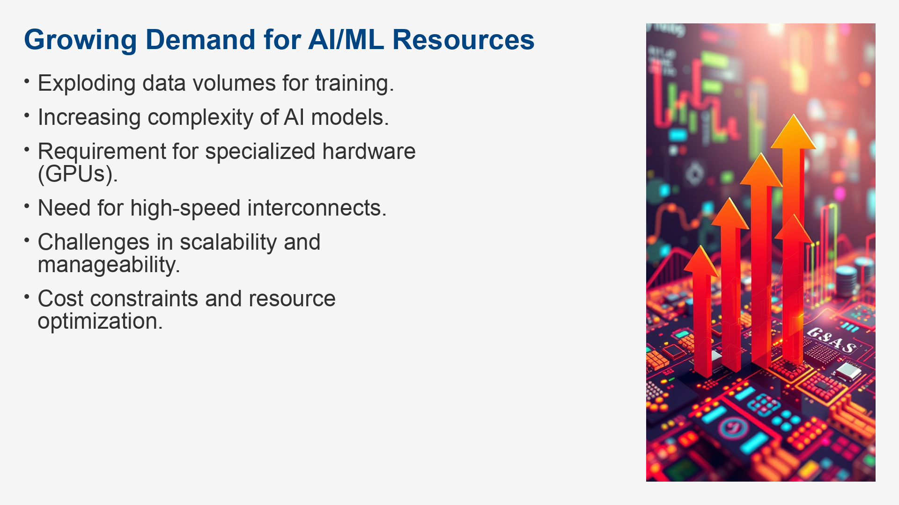

- Exploding data volumes for training.
- Increasing complexity of AI models.
- Requirement for specialized hardware (GPUs).
- Need for high-speed interconnects.
- Challenges in scalability and manageability.
- Cost constraints and resource optimization.

#### Data Bottlenecks in AI Workflows

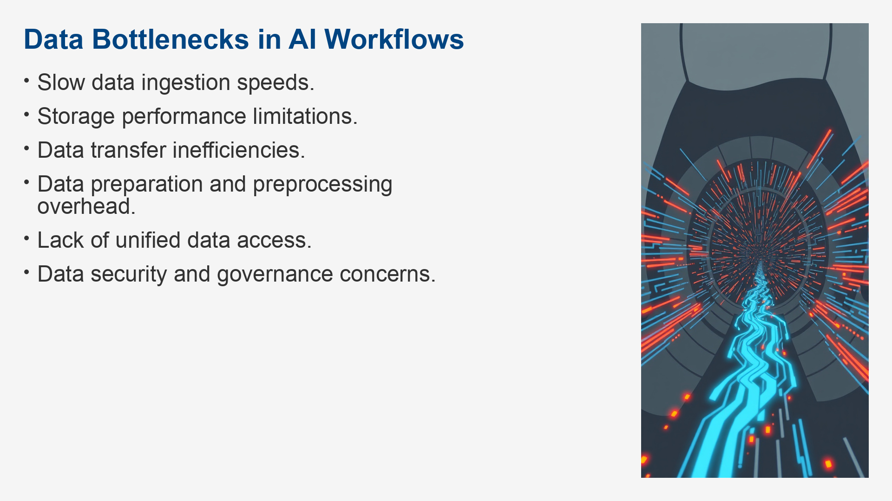

- Slow data ingestion speeds.
- Storage performance limitations.
- Data transfer inefficiencies.
- Data preparation and preprocessing overhead.
- Lack of unified data access.
- Data security and governance concerns.

#### Compute Limitations for AI Training

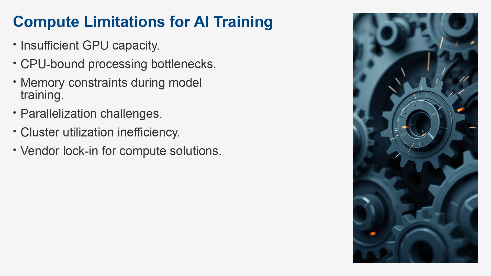

- Insufficient GPU capacity.
- CPU-bound processing bottlenecks.
- Memory constraints during model training.
- Parallelization challenges.
- Cluster utilization inefficiency.
- Vendor lock-in for compute solutions.

#### Network Inefficiencies

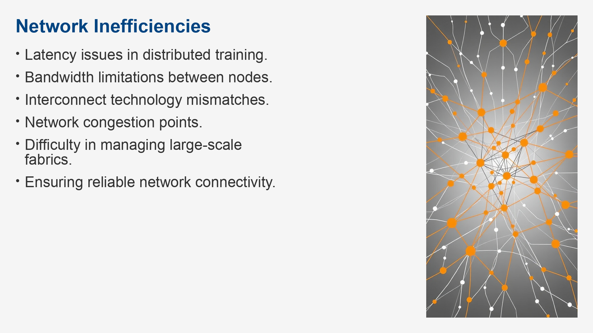

- Latency issues in distributed training.
- Bandwidth limitations between nodes.
- Interconnect technology mismatches.
- Network congestion points.
- Difficulty in managing large-scale fabrics.
- Ensuring reliable network connectivity.

#### Operational Complexity

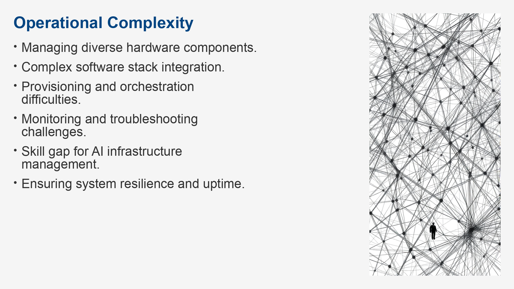

- Managing diverse hardware components.
- Complex software stack integration.
- Provisioning and orchestration difficulties.
- Monitoring and troubleshooting challenges.
- Skill gap for AI infrastructure management.
- Ensuring system resilience and uptime.

#### The Need for an Integrated Solution

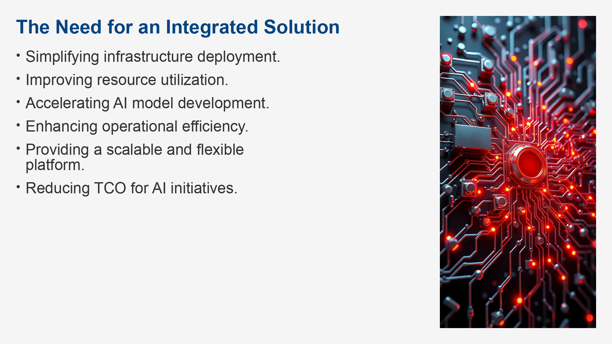

- Simplifying infrastructure deployment.
- Improving resource utilization.
- Accelerating AI model development.
- Enhancing operational efficiency.
- Providing a scalable and flexible platform.
- Reducing TCO for AI initiatives.

### Cisco's Approach to AI/ML Infrastructure

#### Vision for AI-Optimized Infrastructure

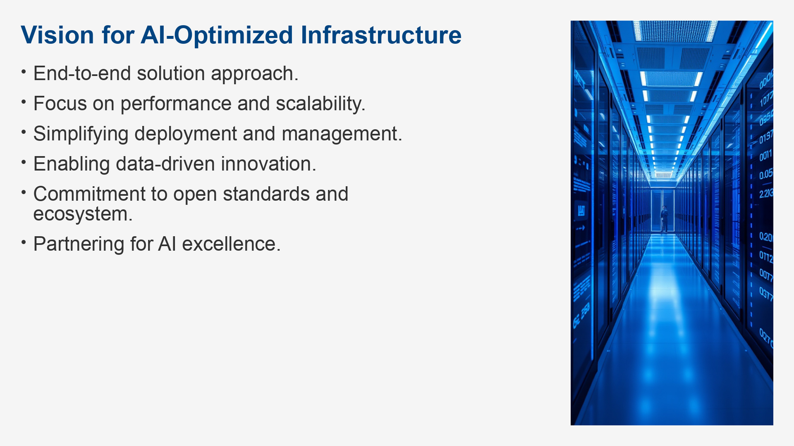

- End-to-end solution approach.
- Focus on performance and scalability.
- Simplifying deployment and management.
- Enabling data-driven innovation.
- Commitment to open standards and ecosystem.
- Partnering for AI excellence.

#### Key Pillars of Cisco's AI Strategy

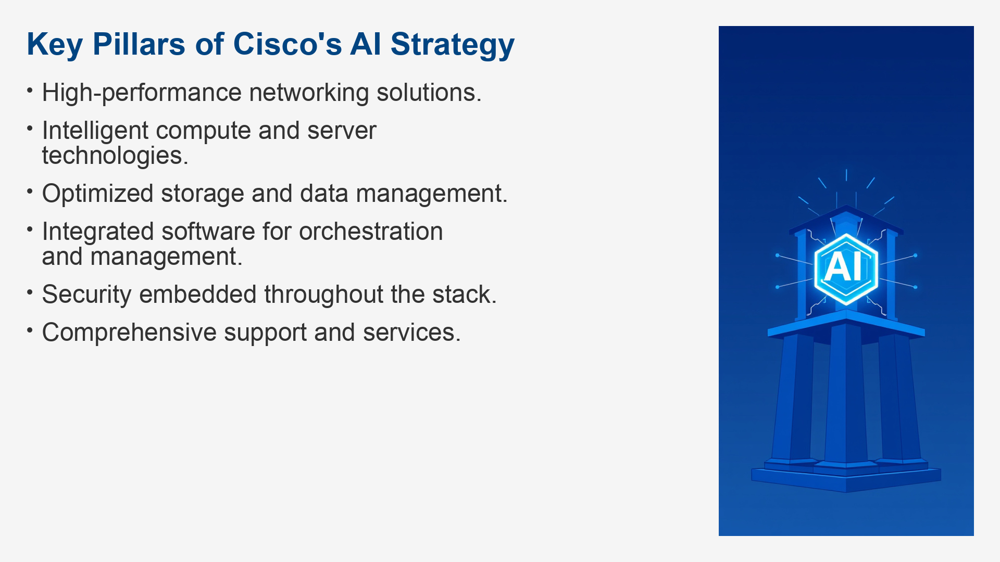

- High-performance networking solutions.
- Intelligent compute and server technologies.
- Optimized storage and data management.
- Integrated software for orchestration and management.
- Security embedded throughout the stack.
- Comprehensive support and services.

#### Leveraging Cisco's Networking Expertise

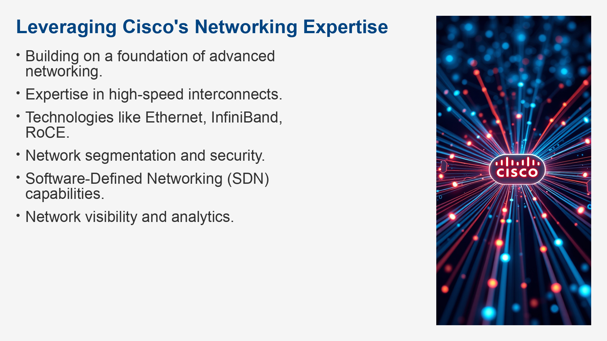

- Building on a foundation of advanced networking.
- Expertise in high-speed interconnects.
- Technologies like Ethernet, InfiniBand, RoCE.
- Network segmentation and security.
- Software-Defined Networking (SDN) capabilities.
- Network visibility and analytics.

#### Integrating with Leading AI/ML Ecosystem Partners

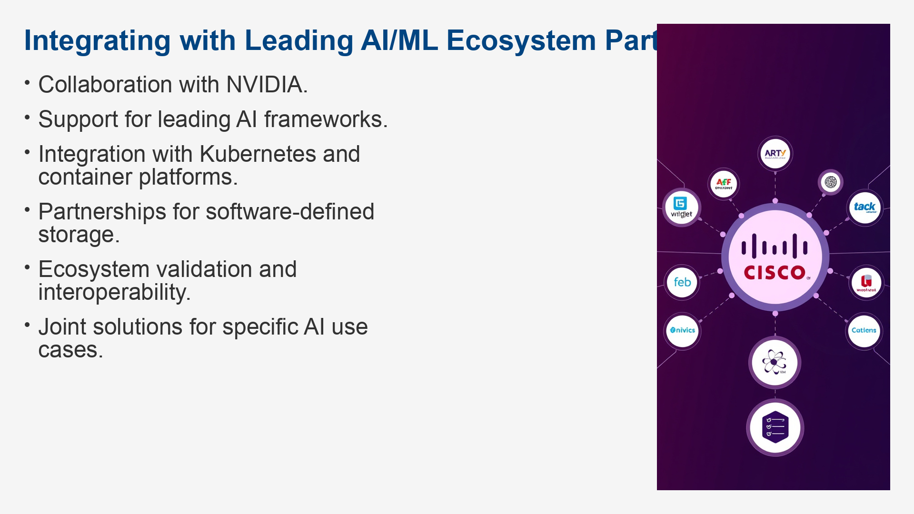

- Collaboration with NVIDIA.
- Support for leading AI frameworks.
- Integration with Kubernetes and container platforms.
- Partnerships for software-defined storage.
- Ecosystem validation and interoperability.
- Joint solutions for specific AI use cases.

#### Cisco HyperFabric as a Unified Solution

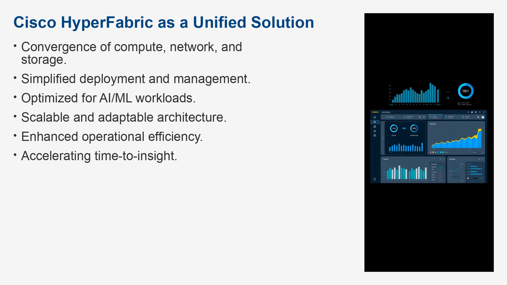

- Convergence of compute, network, and storage.
- Simplified deployment and management.
- Optimized for AI/ML workloads.
- Scalable and adaptable architecture.
- Enhanced operational efficiency.
- Accelerating time-to-insight.

### Cisco HyperFabric for AI Overview and Value Proposition

#### What is Cisco HyperFabric for AI?

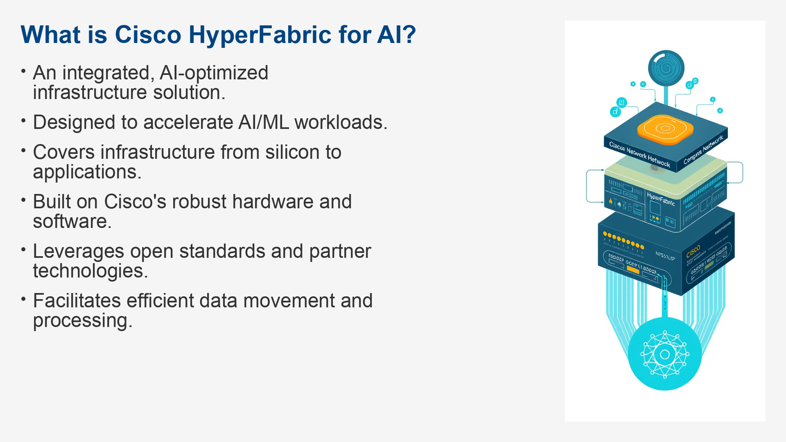

- An integrated, AI-optimized infrastructure solution.
- Designed to accelerate AI/ML workloads.
- Covers infrastructure from silicon to applications.
- Built on Cisco's robust hardware and software.
- Leverages open standards and partner technologies.
- Facilitates efficient data movement and processing.

#### Key Value Propositions

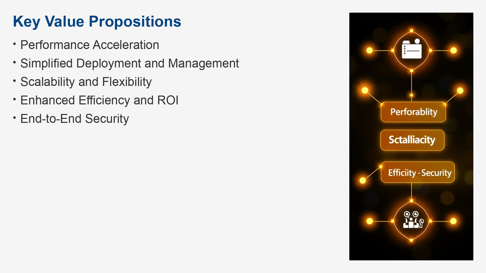

- Performance Acceleration
- Simplified Deployment and Management
- Scalability and Flexibility
- Enhanced Efficiency and ROI
- End-to-End Security

### Key Use Cases and Business Benefits

#### Accelerated Model Training

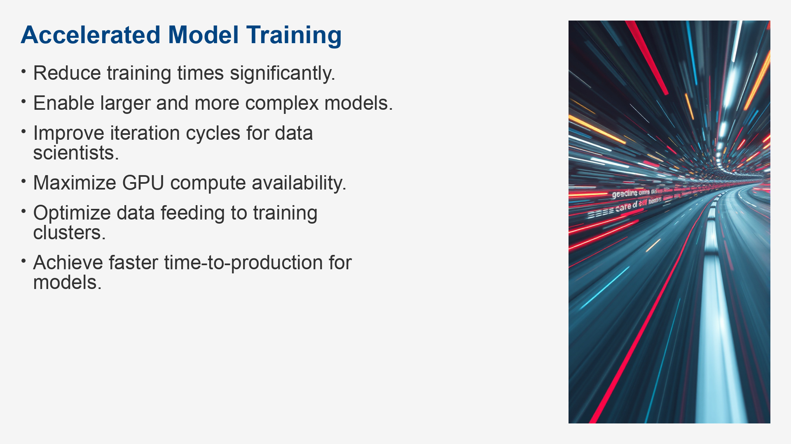

- Reduce training times significantly.
- Enable larger and more complex models.
- Improve iteration cycles for data scientists.
- Maximize GPU compute availability.
- Optimize data feeding to training clusters.
- Achieve faster time-to-production for models.

#### High-Performance Inference

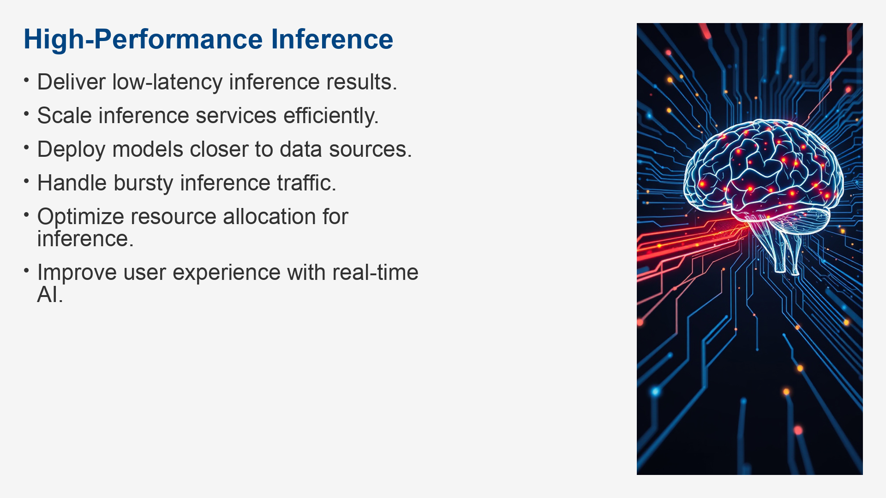

- Deliver low-latency inference results.
- Scale inference services efficiently.
- Deploy models closer to data sources.
- Handle bursty inference traffic.
- Optimize resource allocation for inference.
- Improve user experience with real-time AI.

#### Large-Scale Data Processing and Analytics

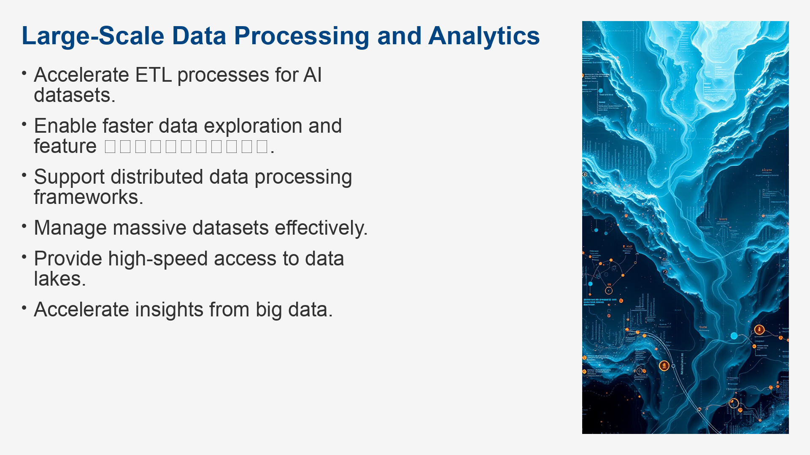

- Accelerate ETL processes for AI datasets.
- Enable faster data exploration and feature इंजीनियरिंग.
- Support distributed data processing frameworks.
- Manage massive datasets effectively.
- Provide high-speed access to data lakes.
- Accelerate insights from big data.

#### Genomics and Life Sciences

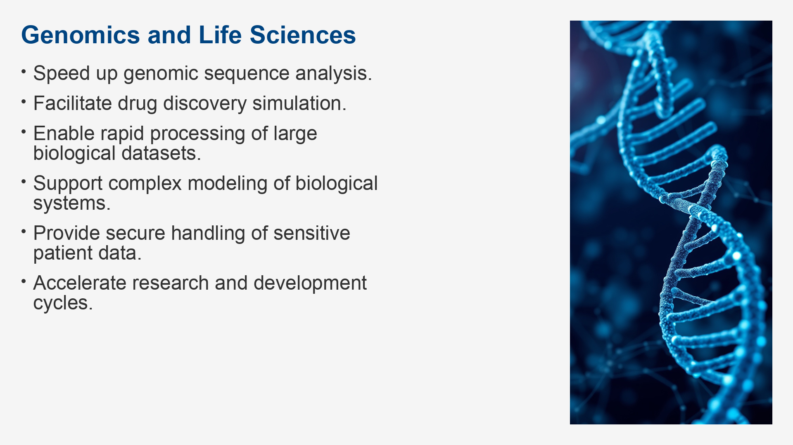

- Speed up genomic sequence analysis.
- Facilitate drug discovery simulation.
- Enable rapid processing of large biological datasets.
- Support complex modeling of biological systems.
- Provide secure handling of sensitive patient data.
- Accelerate research and development cycles.

#### Financial Services

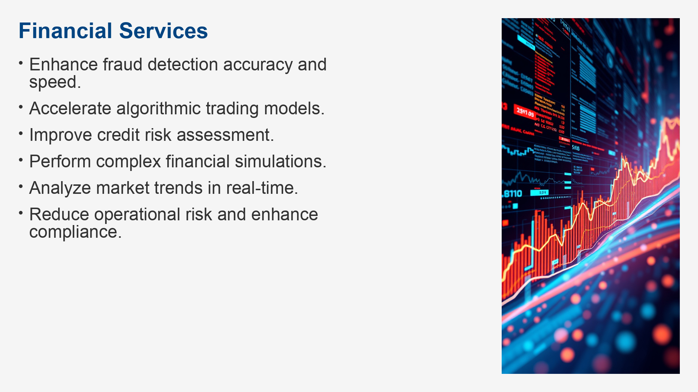

- Enhance fraud detection accuracy and speed.
- Accelerate algorithmic trading models.
- Improve credit risk assessment.
- Perform complex financial simulations.
- Analyze market trends in real-time.
- Reduce operational risk and enhance compliance.

#### Automotive and Industrial IoT

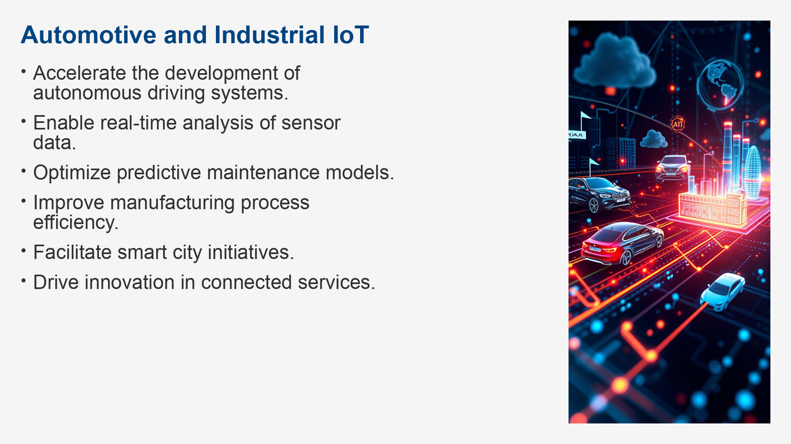

- Accelerate the development of autonomous driving systems.
- Enable real-time analysis of sensor data.
- Optimize predictive maintenance models.
- Improve manufacturing process efficiency.
- Facilitate smart city initiatives.
- Drive innovation in connected services.

#### Business Benefits Across Industries

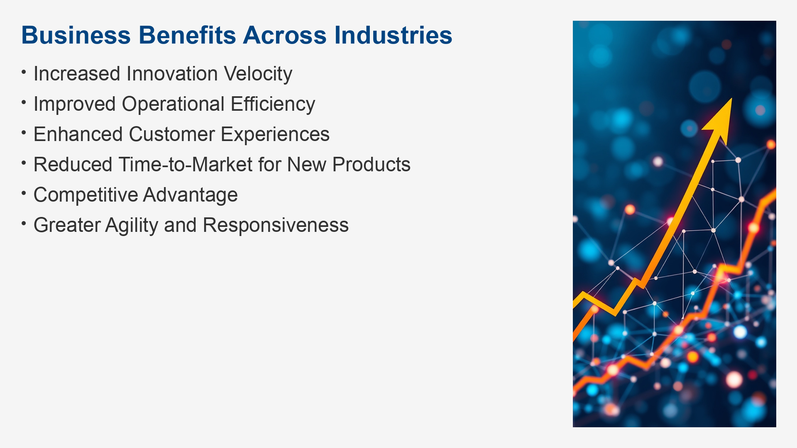

- Increased Innovation Velocity
- Improved Operational Efficiency
- Enhanced Customer Experiences
- Reduced Time-to-Market for New Products
- Competitive Advantage
- Greater Agility and Responsiveness

## 2: Cisco HyperFabric for AI Architecture

### Core Components (Compute, Network, Storage)

#### Compute Nodes

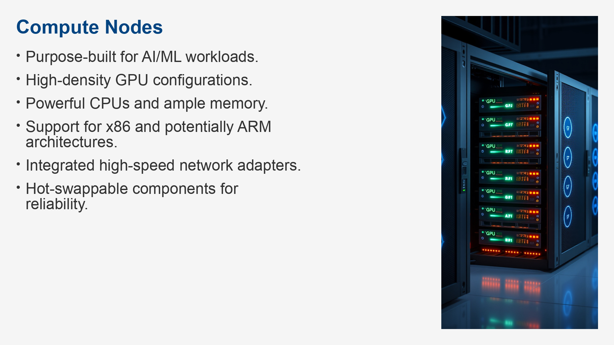

- Purpose-built for AI/ML workloads.
- High-density GPU configurations.
- Powerful CPUs and ample memory.
- Support for x86 and potentially ARM architectures.
- Integrated high-speed network adapters.
- Hot-swappable components for reliability.

#### Network Fabric

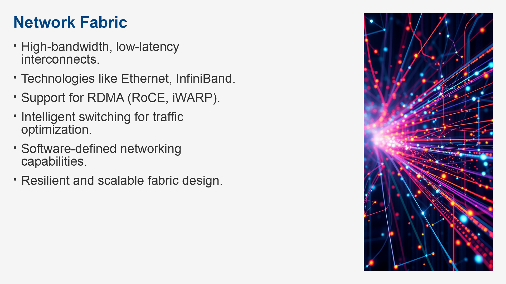

- High-bandwidth, low-latency interconnects.
- Technologies like Ethernet, InfiniBand.
- Support for RDMA (RoCE, iWARP).
- Intelligent switching for traffic optimization.
- Software-defined networking capabilities.
- Resilient and scalable fabric design.

#### Storage Solutions

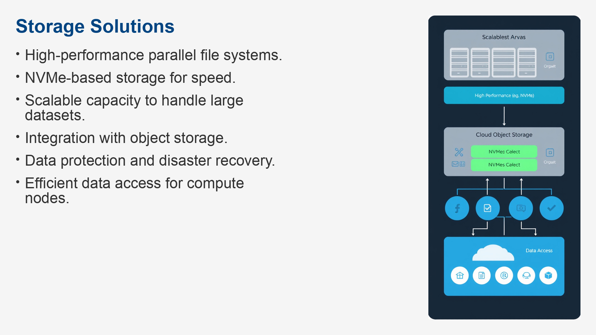

- High-performance parallel file systems.
- NVMe-based storage for speed.
- Scalable capacity to handle large datasets.
- Integration with object storage.
- Data protection and disaster recovery.
- Efficient data access for compute nodes.

#### Management and Orchestration Layer

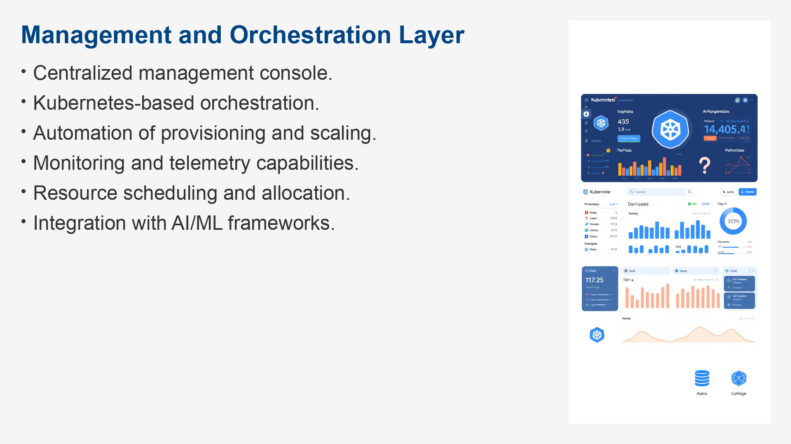

- Centralized management console.
- Kubernetes-based orchestration.
- Automation of provisioning and scaling.
- Monitoring and telemetry capabilities.
- Resource scheduling and allocation.
- Integration with AI/ML frameworks.

### Integration with NVIDIA AI Enterprise

#### What is NVIDIA AI Enterprise?

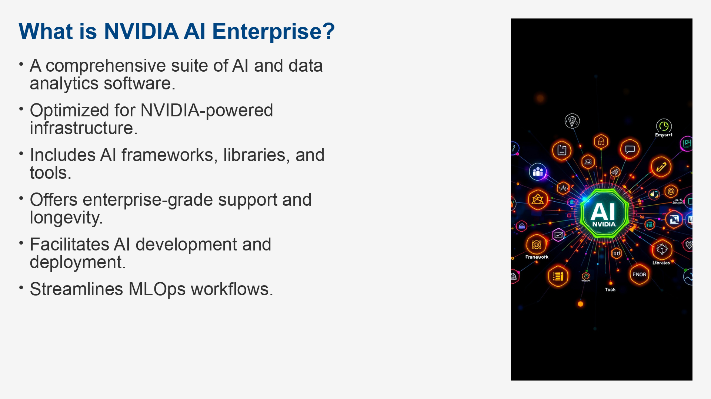

- A comprehensive suite of AI and data analytics software.
- Optimized for NVIDIA-powered infrastructure.
- Includes AI frameworks, libraries, and tools.
- Offers enterprise-grade support and longevity.
- Facilitates AI development and deployment.
- Streamlines MLOps workflows.

#### Key Components of NVIDIA AI Enterprise

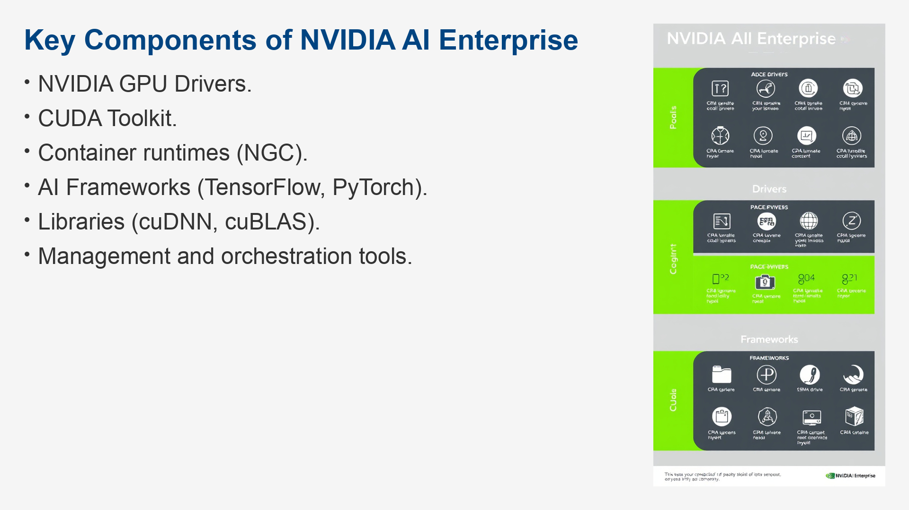

- NVIDIA GPU Drivers.
- CUDA Toolkit.
- Container runtimes (NGC).
- AI Frameworks (TensorFlow, PyTorch).
- Libraries (cuDNN, cuBLAS).
- Management and orchestration tools.

#### How HyperFabric Integrates with NVIDIA AI Enterprise

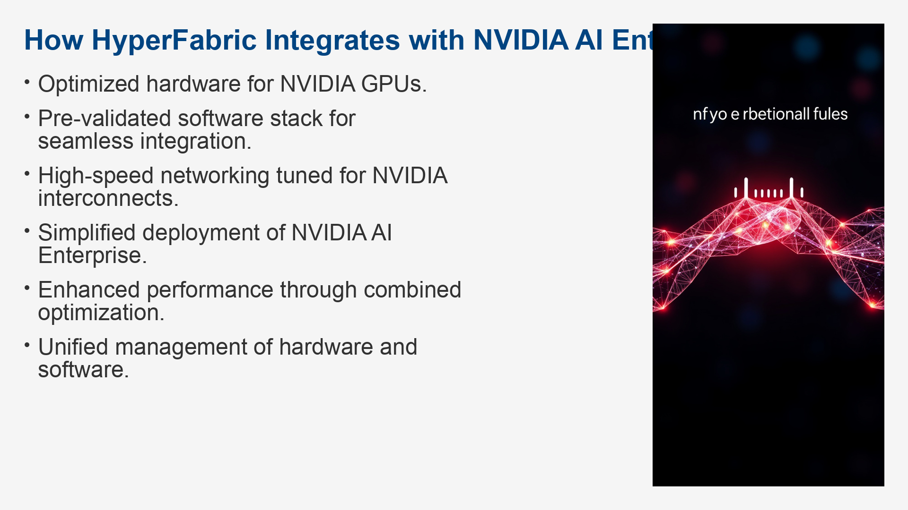

- Optimized hardware for NVIDIA GPUs.
- Pre-validated software stack for seamless integration.
- High-speed networking tuned for NVIDIA interconnects.
- Simplified deployment of NVIDIA AI Enterprise.
- Enhanced performance through combined optimization.
- Unified management of hardware and software.

#### Benefits of the Integrated Solution

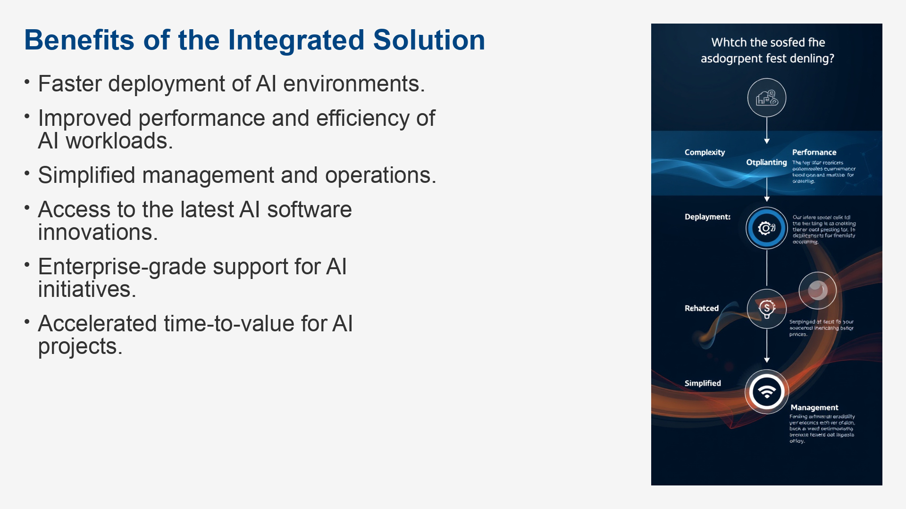

- Faster deployment of AI environments.
- Improved performance and efficiency of AI workloads.
- Simplified management and operations.
- Access to the latest AI software innovations.
- Enterprise-grade support for AI initiatives.
- Accelerated time-to-value for AI projects.

### Software Stack Overview (Kubernetes, AI/ML Frameworks)

#### Kubernetes as the Orchestration Layer

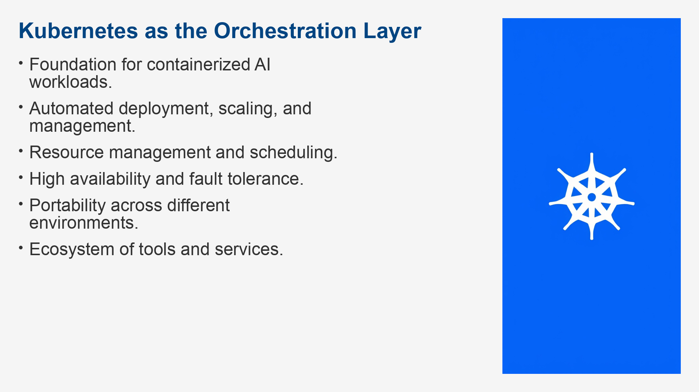

- Foundation for containerized AI workloads.
- Automated deployment, scaling, and management.
- Resource management and scheduling.
- High availability and fault tolerance.
- Portability across different environments.
- Ecosystem of tools and services.

#### Key AI/ML Frameworks Supported

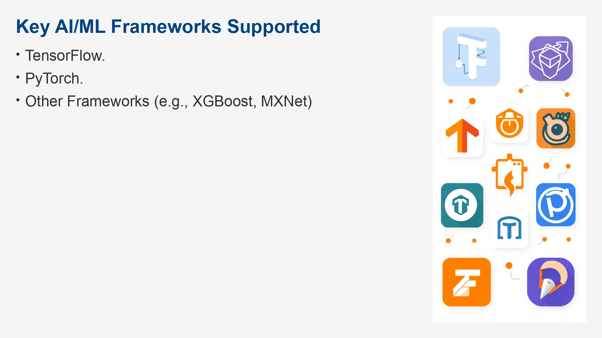

- TensorFlow.
- PyTorch.
- Other Frameworks (e.g., XGBoost, MXNet)

#### Containerization of AI/ML Applications

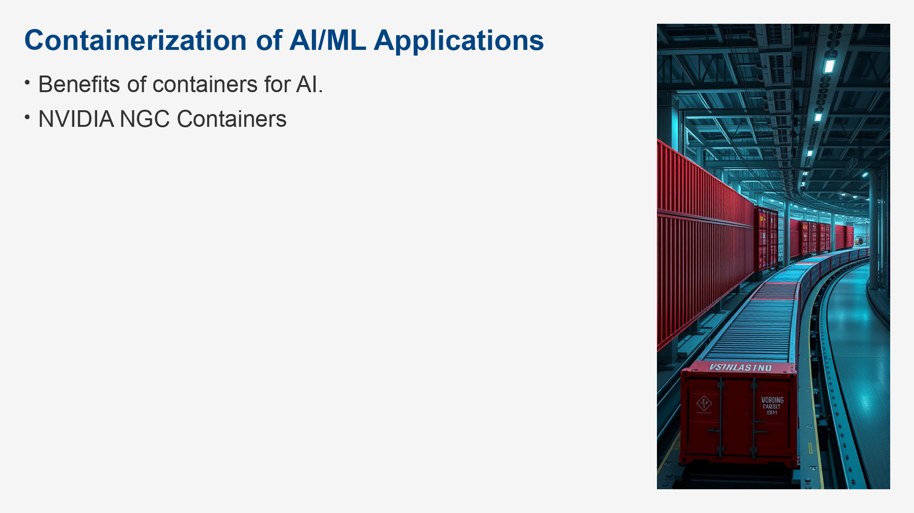

- Benefits of containers for AI.
- NVIDIA NGC Containers

### Data Flow and Connectivity within HyperFabric

#### Data Ingestion Pathways

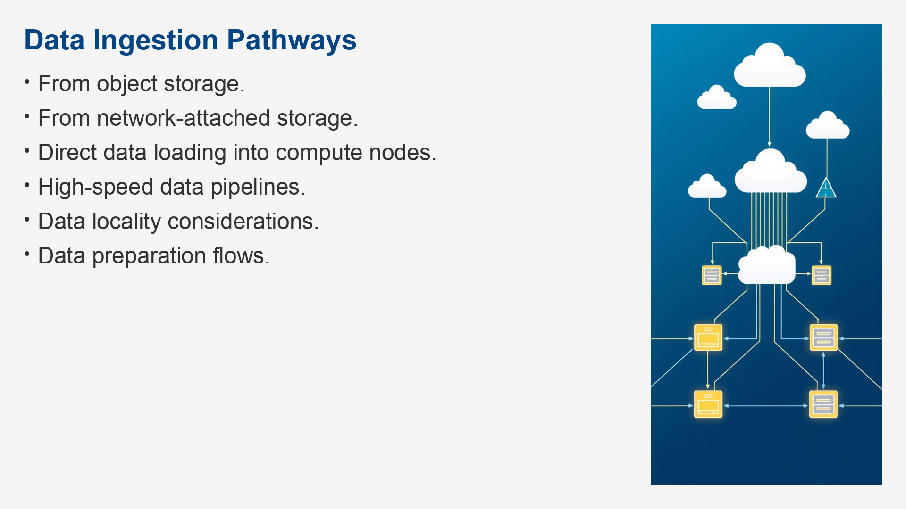

- From object storage.
- From network-attached storage.
- Direct data loading into compute nodes.
- High-speed data pipelines.
- Data locality considerations.
- Data preparation flows.

#### Data Movement for Training

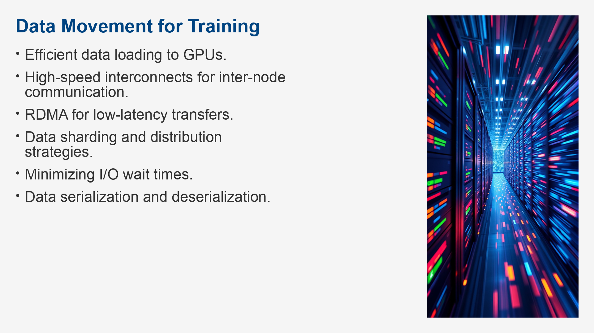

- Efficient data loading to GPUs.
- High-speed interconnects for inter-node communication.
- RDMA for low-latency transfers.
- Data sharding and distribution strategies.
- Minimizing I/O wait times.
- Data serialization and deserialization.

#### Data Access for Inference

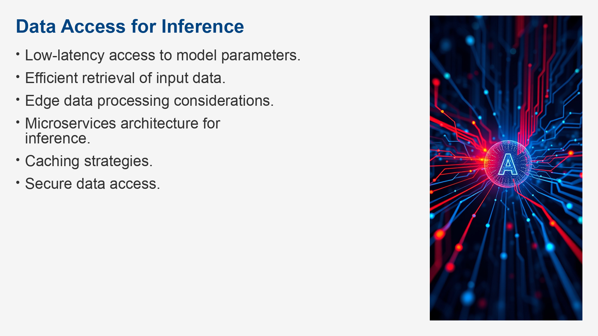

- Low-latency access to model parameters.
- Efficient retrieval of input data.
- Edge data processing considerations.
- Microservices architecture for inference.
- Caching strategies.
- Secure data access.

#### Network Fabric Role in Data Flow

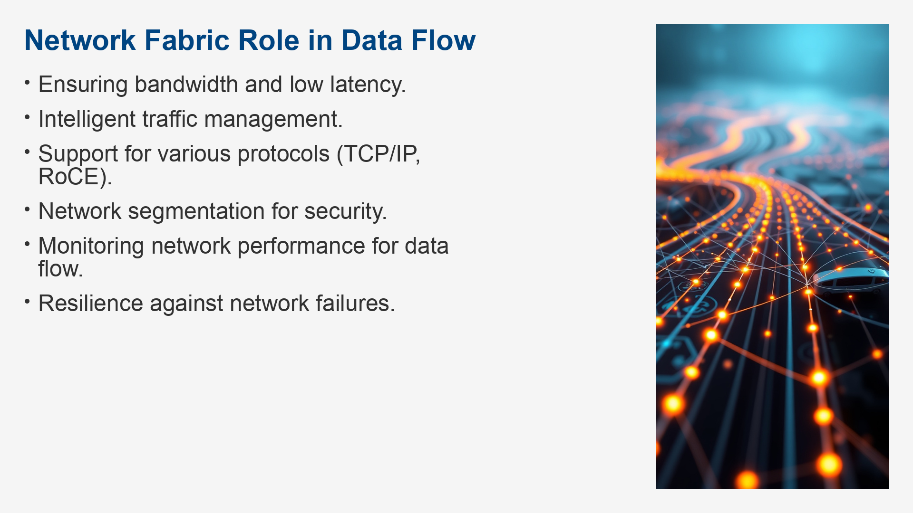

- Ensuring bandwidth and low latency.
- Intelligent traffic management.
- Support for various protocols (TCP/IP, RoCE).
- Network segmentation for security.
- Monitoring network performance for data flow.
- Resilience against network failures.

#### Storage Connectivity

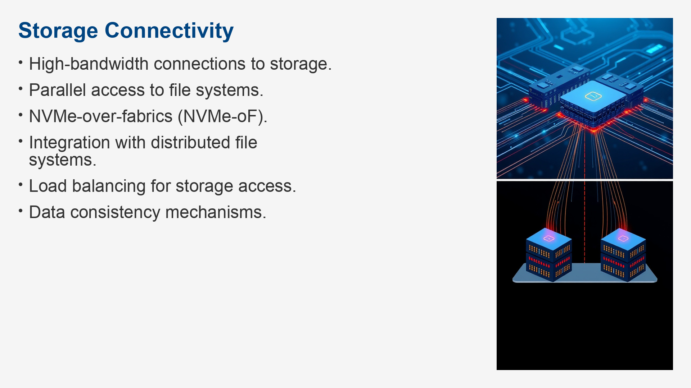

- High-bandwidth connections to storage.
- Parallel access to file systems.
- NVMe-over-fabrics (NVMe-oF).
- Integration with distributed file systems.
- Load balancing for storage access.
- Data consistency mechanisms.

#### Orchestration of Data Pipelines

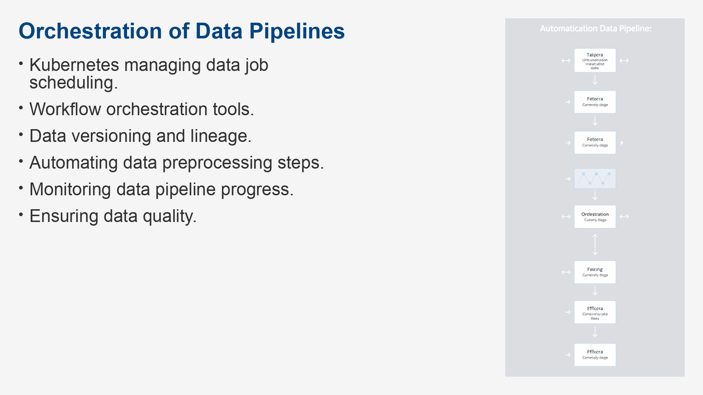

- Kubernetes managing data job scheduling.
- Workflow orchestration tools.
- Data versioning and lineage.
- Automating data preprocessing steps.
- Monitoring data pipeline progress.
- Ensuring data quality.

## 3: Deploying Cisco HyperFabric for AI

### Planning and Sizing for AI Workloads

#### Identifying AI Project Requirements

- Type of AI models (CNN, RNN, Transformers).
- Data size and complexity.
- Computational needs (FLOPS, GPU memory).
- Training vs. inference requirements.
- Accuracy and performance targets.
- Development and production environments.

#### Assessing Compute Resources

- GPU type and quantity.
- CPU cores and clock speed.
- RAM capacity and speed.
- Interconnect bandwidth between nodes.
- Power and cooling considerations.
- Scalability requirements.

#### Evaluating Network Requirements

- Required bandwidth per node.
- Acceptable latency thresholds.
- RDMA support needs.
- Network topology planning.
- Port density and switch capabilities.
- Network security policies.

#### Determining Storage Needs

- Total data volume.
- I/O performance requirements (IOPS, throughput).
- Data access patterns.
- Data lifecycle management.
- Data protection and backup strategy.
- Storage scalability.

#### Software Stack Considerations

- Required AI/ML frameworks and libraries.
- Containerization strategy.
- Orchestration platform (Kubernetes version).
- Operating system compatibility.
- MLOps tools integration.
- Security and access control policies.

#### Cisco HyperFabric Sizing Tools and Guidelines

- Utilizing Cisco design guides.
- Engaging with Cisco Solution Architects.
- Running performance benchmarks.
- Capacity planning based on project roadmap.
- Considering growth factors and future needs.
- Documenting all assumptions.

### Installation and Initial Setup

#### Pre-installation Checklist

- Hardware procurement and validation.
- Network connectivity and IP addressing.
- Power and environmental readiness.
- Management station setup.
- Firmware and software version checks.
- Required credentials and access rights.

#### Hardware Deployment

- Rack and stack server and storage hardware.
- Connect network cabling according to design.
- Power on components in sequence.
- BMC/iDRAC configuration.
- Initial BIOS settings.
- Cable management best practices.

#### Base Software Installation

- Installing the operating system on compute nodes.
- Network switch configuration (VLANs, IP connectivity).
- Storage system initialization.
- Management software installation.
- Basic network service setup (DNS, NTP).
- Security hardening of base system.

#### HyperFabric Software Deployment

- Deployment of Kubernetes cluster.
- Installation of Cisco's specialized HyperFabric software.
- Integration with NVIDIA AI Enterprise components.
- Configuration of GPU drivers and CUDA.
- Deployment of necessary container runtimes.
- Initial security policy enforcement.

#### Initial System Verification

- Verifying hardware health checks.
- Confirming network reachability.
- Validating storage connectivity and performance.
- Checking Kubernetes cluster status.
- Basic functionality tests of deployed software.
- Reviewing installation logs for errors.

### Network and Storage Configuration Best Practices

#### Network Configuration

- VLAN segmentation for traffic isolation.
- IP addressing scheme planning.
- Configuring high-speed interconnects (e.g., InfiniBand, RoCE).
- Tuning network parameters for low latency.
- Implementing Quality of Service (QoS) policies.
- Network monitoring and alerting setup.

#### Storage Configuration

- Creating and mounting high-performance file systems.
- Optimizing file system parameters for AI workloads.
- Implementing data striping and caching.
- Configuring access control lists (ACLs).
- Setting up quotas and storage limits.
- Integrating with Kubernetes storage classes.

#### Security Configuration

- Implementing Role-Based Access Control (RBAC).
- Network security best practices (firewalls, segmentation).
- Securing API endpoints.
- Managing secrets and sensitive data.
- Regular security patching and audits.
- Data encryption at rest and in transit.

#### Management and Monitoring Setup

- Configuring the unified management interface.
- Setting up telemetry and logging.
- Integrating with existing monitoring tools.
- Establishing alerts for critical events.
- Defining performance metrics to track.
- User account management.

#### High Availability and Fault Tolerance

- Redundant network paths.
- RAID configurations for storage.
- High-availability cluster configurations.
- Graceful handling of component failures.
- Disaster recovery planning.
- Regular backups.

### Validated Designs and Reference Architectures

#### Understanding Validated Designs

- Purpose: ensuring interoperability and performance.
- Based on extensive testing.
- Simplify deployment decisions.
- Reduce risk of misconfiguration.
- Provided by Cisco and partners.
- Documented configurations for specific use cases.

#### Key Reference Architectures

- GPU-Optimized Compute Clusters.
- High-Throughput Inference Platforms.
- Distributed Data Processing Solutions.
- Hybrid Cloud AI Deployments.

#### Choosing the Right Reference Architecture

- Matching architecture to workload.
- Considering existing infrastructure.
- Budget and resource constraints.
- Future scalability needs.
- Performance requirements.
- Vendor support and interoperability.

#### Customization of Reference Architectures

- Adapting to specific requirements.
- Understanding architectural trade-offs.
- Validating changes thoroughly.
- Documenting any deviations.
- Ensuring continued supportability.
- Performing capacity planning for customizations.

## 4: Compute and GPU Management

### NVIDIA GPU Integration and Management

#### Understanding NVIDIA GPU Architecture

- SMs (Streaming Multiprocessors).
- Tensor Cores for AI acceleration.
- CUDA Cores for parallel processing.
- GPU Memory (GDDR6, HBM2).
- NVLink for high-speed GPU interconnect.
- MIG (Multi-Instance GPU) technology.

#### Installing NVIDIA Drivers and CUDA

- Driver installation procedures.
- CUDA Toolkit compatibility and installation.
- Driver version management.
- Verifying driver and CUDA installation.
- Handling driver conflicts.
- Optimal driver settings for AI workloads.

#### GPU Virtualization and Partitioning (MIG)

- What is MIG?
- Enabling and configuring MIG.

#### Monitoring GPU Performance

- NVIDIA-SMI utility.
- Integration with HyperFabric monitoring.

#### GPU Lifecycle Management

- Firmware updates for GPUs.
- Driver rollbacks.
- Handling GPU hardware failures.
- GPU maintenance schedules.
- Decommissioning GPUs.
- Tracking GPU inventory.

### Kubernetes for Container Orchestration

#### Kubernetes Architecture Overview

- Control Plane (API Server, Scheduler, Controller Manager).
- Node components (Kubelet, Kube-proxy, Container Runtime).
- Pods, Services, Deployments, StatefulSets.
- Persistent Volumes and Storage Classes.
- Networking: CNI, Services, Ingress.
- RBAC for security.

#### Deploying AI/ML Workloads on Kubernetes

- Containerizing AI applications.
- Defining Kubernetes Deployments or Jobs.
- Resource requests and limits (CPU, Memory, GPU).
- Using Persistent Volumes for data.
- Scheduling AI workloads to GPU nodes.
- Managing dependencies with ConfigMaps and Secrets.

#### GPU Resource Management in Kubernetes

- Kubernetes scheduler and GPU awareness.
- Leveraging the NVIDIA Device Plugin.
- Requesting GPUs in Pod specifications.
- Allocating MIG instances as GPUs.
- GPU sharing policies.
- Monitoring GPU allocation.

#### Scaling AI Workloads

- Horizontal Pod Autoscaler (HPA).
- Cluster Autoscaler for node provisioning.
- Custom metrics for autoscaling.
- Scaling inference services based on load.
- Scaling distributed training jobs.
- Auto-scaling for data processing tasks.

#### Kubernetes Networking for AI

- High-performance CNI plugins.
- Service discovery and load balancing.
- Network policies for security.
- Exposing AI services (e.g., inference endpoints).
- Load balancing for distributed training communication.
- Efficient data transfer over the network.

### Resource Allocation and Scheduling for AI/ML

#### Understanding Kubernetes Scheduling

- Predicate and Priority functions.
- Scheduling decisions based on resource availability.
- Node affinity and anti-affinity.
- Pod affinity and anti-affinity.
- Taints and Tolerations.
- Custom schedulers.

#### GPU Scheduling Strategies

- First-fit, best-fit GPU scheduling.
- Fair-share GPU allocation.
- Topology-aware GPU scheduling.
- Scheduling based on MIG instances.
- Ensuring GPU availability for critical workloads.
- Managing GPU fragmentation.

#### Optimizing Resource Allocation for Training

- Allocating appropriate GPU memory.
- Ensuring sufficient CPU and RAM.
- Balancing compute and data loading resources.
- Distributed training resource requirements.
- Node selectors for specific hardware.
- Resource quotas and limits per namespace.

#### Optimizing Resource Allocation for Inference

- Minimum resources for low latency.
- Autoscaling based on request load.
- Strategic placement of inference pods.
- Efficient use of CPU and GPU for inference tasks.
- Managing memory for model loading.
- Resource isolation for critical inference services.

#### Managing Shared Resources

- Policies for sharing GPUs among users/teams.
- Resource quotas and limits.
- Priority classes for critical jobs.
- Using Kubernetes namespaces effectively.
- Monitoring resource consumption.
- Fair usage policies.

### Performance Tuning for Compute Resources

#### Optimizing GPU Utilization

- Batching requests for inference.
- Efficient data preprocessing.
- Avoiding CPU bottlenecks in data loading.
- Using mixed precision training.
- Minimizing context switching overhead.
- Profiling to identify GPU bottlenecks.

#### CPU Tuning for AI/ML

- Optimizing CPU affinity for critical processes.
- Ensuring sufficient CPU for data pipelines.
- NUMA-aware programming.
- Compiler optimizations.
- Thread pool management.
- Reducing context switching.

#### Memory Optimization

- Efficient data handling.
- Gradient checkpointing for large models.
- Reducing memory footprint of models.
- Monitoring memory usage.
- Page cache tuning.
- Avoiding out-of-memory errors.

#### Network Tuning for Compute Performance

- Optimizing RDMA parameters.
- TCP/IP stack tuning.
- Buffering and congestion control.
- Reducing inter-process communication overhead.
- Ensuring network fabric is not a bottleneck.
- Impact of network latency on distributed performance.

#### Storage Performance Tuning

- File system mount options.
- Read/write caching strategies.
- Data placement and locality.
- Impact of block sizes.
- Optimizing for sequential vs. random I/O.
- Monitoring storage I/O.

#### Application-Level Tuning

- Profiling application code.
- Optimizing data preprocessing steps.
- Efficient model implementation.
- Using optimized libraries.
- Parallelizing computations where possible.
- Performance testing under load.

## 5: Network Optimization for AI

### High-Performance Networking (e.g., InfiniBand, Ethernet)

#### Evolution of High-Performance Networking

- From Gigabit Ethernet to 100GbE and beyond.
- Emergence of InfiniBand for HPC.
- Convergence of Ethernet and HPC networking.
- Role of advanced protocols like RDMA.
- Importance of fabric scalability.
- Impact on AI/ML workload performance.

#### InfiniBand Technology

- Architecture and key features.
- Low latency and high bandwidth.
- Zero-copy data transfers.
- Support for MPI and other HPC communication libraries.
- Common use cases.
- Management and configuration aspects.

#### High-Speed Ethernet (100GbE, 200GbE, 400GbE)

- Ethernet standards and evolution.
- Cost-effectiveness and wider adoption.
- Need for RDMA over Converged Ethernet (RoCE).
- Link aggregation for increased bandwidth.
- DCB (Data Center Bridging) for lossless Ethernet.
- QSFP, OSFP and other transceiver types.

#### Comparing InfiniBand and High-Speed Ethernet

- Latency differences.
- Bandwidth capabilities.
- Protocol support.
- Complexity of deployment and management.
- Ecosystem and vendor support.
- Cost considerations.

#### Cisco's Networking Solutions for AI

- Ethernet switches with high port density and speed.
- Support for advanced Ethernet features.
- Integration with NVIDIA networking components.
- Software-defined networking capabilities.
- Unified management of network infrastructure.
- Security features within the fabric.

### Network Fabric Design for AI/ML Traffic

#### Fabric Topologies

- Fat-Tree / Clos Networks.
- Dragonfly Topology.
- Other Topologies (e.g., Torus, Mesh).

#### Traffic Classification and Prioritization

- Identifying AI/ML traffic types.
- Quality of Service (QoS) mechanisms.

#### Congestion Management

- Causes of network congestion in AI clusters.
- Lossless Ethernet (DCB, PFC).
- ECN (Explicit Congestion Notification).
- Buffer management in switches.

#### Network Segmentation and Isolation

- VLANs for logical separation.
- VXLAN/Geneve for overlay networks.
- Network security groups.
- Isolating compute, storage, and management traffic.
- Kubernetes Network Policies.
- Ensuring secure communication channels.

### RDMA over Converged Ethernet (RoCE)

#### What is RDMA?

- Remote Direct Memory Access.
- Zero-copy data transfer.
- Low CPU overhead.
- Reduced latency.
- Offloading network processing.
- Enabling efficient inter-process communication.

#### RoCE v1 vs. RoCE v2

- RoCE v1 Layer 2 scope.
- RoCE v2 Layer 3 scope.

#### Requirements for RoCE Deployment

- RDMA-capable Network Interface Cards (NICs).
- Lossless Ethernet Network
- IP Addressing and Routing
- OS and Software Configuration

#### Use of RoCE in AI/ML Workflows

- Accelerating distributed training.
- High-performance inference communication.
- Data loading and preprocessing acceleration.
- Communication between distributed components.

### Network Monitoring and Troubleshooting

#### Key Network Metrics for AI workloads

- Throughput (Gbps, Mbps).
- Latency (microseconds, milliseconds).
- Packet Loss Rate (PPM, percentage).
- Jitter.
- Error counters on interfaces.
- Bandwidth utilization.

#### Tools for Network Monitoring

- Cisco Nexus Dashboard / NX-OS monitoring.
- Host-based monitoring tools.
- Application Performance Monitoring (APM) integration.
- Packet capture and analysis.

#### Common Network Troubleshooting Scenarios

- Low throughput issues.
- High latency issues.
- Packet loss.
- Connectivity problems.
- RoCE/RDMA specific issues.
- Configuration errors.

#### Best Practices for Network Troubleshooting in AI Environments

- Establish a baseline for normal performance.
- Monitor metrics proactively.
- Use consistent diagnostic tools.
- Isolate the problem domain (node, switch, link).
- Reproduce the issue if possible.
- Consult vendor documentation and support.

## 6: Storage Solutions for AI

### High-Performance Storage for AI/ML Data

#### Characteristics of AI/ML Data Access Patterns

- Large sequential reads for training data.
- Small random reads/writes for checkpoints, logs.
- High ingest rates during data collection.
- Concurrent access from many compute nodes.
- Metadata intensive operations.
- Growing datasets requiring scalability.

#### Storage Tiers and Technologies

- NVMe SSDs.
- SAS/SATA SSDs.
- HDDs (Hard Disk Drives).
- Object Storage.

#### Parallel File Systems

- Lustre, GPFS (Spectrum Scale), BeeGFS.
- Designed for high-performance, concurrent access.
- Distributed metadata and data management.
- Scalability to thousands of clients.
- Performance tuning for specific workloads.
- Common in HPC and AI clusters.

#### Cisco's Storage Offerings for AI

- Integration with high-performance storage solutions.
- Support for various storage protocols (NFS, SMB, iSCSI, S3).
- Solutions optimized for AI data pipelines.
- Management and orchestration of storage resources.
- Partnership with leading storage vendors.
- Ensuring storage meets demanding AI I/O.

### Data Management and Lifecycle

#### Data Ingestion and ETL Processes

- Strategies for efficient data loading.
- Data cleaning and transformation pipelines.
- Incremental data updates.
- Data validation and quality checks.
- Integration of data sources.
- Parallel processing for large datasets.

#### Data Versioning and Provenance

- Tracking changes to datasets over time.
- Ensuring reproducibility of AI models.
- Maintaining data lineage.
- Tools for data versioning.
- Impact on MLOps.
- Secure storage of data versions.

#### Data Lifecycle Management Policies

- Archiving older datasets.
- Tiering data to different storage classes.
- Data deletion and retention policies.
- Compliance requirements (GDPR, HIPAA).
- Automation of lifecycle policies.

#### Data Deduplication and Compression

- Techniques to reduce storage footprint.
- Impact on performance.
- Block-level vs. file-level deduplication.
- Compression algorithms.
- Use cases in AI data storage.
- Considerations for real-time access.

### Integration with Distributed File Systems

#### Understanding Distributed File Systems (DFS)

- Concept of data distributed across multiple servers.
- Unified namespace for client access.
- High availability through redundancy.
- Scalability of capacity and performance.
- Fault tolerance mechanisms.
- Client-server architecture.

#### Mounting DFS on Compute Nodes

- NFS, SMB/CIFS clients.
- Specific client software for parallel file systems.
- Kubernetes Persistent Volumes and volume mounts.
- Auto-mounting configurations.
- Permissions and access control.
- Cache settings for performance.

#### Performance Tuning of Mounted File Systems

- File system mount options.
- Client-side caching.
- Server-side optimizations.

#### Integrating with Orchestration (Kubernetes)

- Dynamic provisioning of storage using StorageClasses.
- CSI (Container Storage Interface) drivers.
- Defining Persistent Volume Claims (PVCs).
- Automating storage lifecycle management.
- Handling storage failures.
- Monitoring storage provisioned via Kubernetes.

#### Considerations for AI Workloads

- Ensuring file system can handle concurrent access.
- Optimizing for large file I/O.
- Minimizing metadata operation overhead.
- Data locality and its impact.
- Network bandwidth to storage.
- Performance consistency for training jobs.

### Data Security and Access Control

#### Securing Data in Transit

- TLS/SSL encryption for network protocols.
- VPNs for remote access.
- Secure authentication for storage access.
- Network segmentation (VLANs, firewalls).
- Encryption of RDMA traffic.
- Secure configurations of storage interfaces.

#### Securing Data at Rest

- Full disk encryption (FDE).
- File-level encryption.
- Key management systems (KMS).
- Secure data wiping and decommissioning.
- Encryption of data in backups.
- Storage system specific encryption features.

#### Access Control Mechanisms

- Role-Based Access Control (RBAC).
- POSIX Permissions.
- Kubernetes RBAC integration with storage.

#### Auditing and Compliance

- Logging access to data.
- Compliance standards relevance (GDPR, HIPAA, etc.).
- Implementing security policies.
- Secure data sharing practices.

## 7: Managing AI/ML Workflows on HyperFabric

### Deploying AI/ML Applications

#### Containerizing AI Applications

- Creating Dockerfiles for AI tasks.
- Including dependencies (frameworks, libraries).
- Optimizing image size and build time.
- Using base images from NGC.
- Multi-stage builds.
- Security best practices for container images.

#### Kubernetes Deployment Strategies

- Deployments for stateless applications (e.g., inference services).
- StatefulSets for stateful applications (e.g., databases, distributed training components).
- Jobs for one-off tasks (e.g., data preprocessing).
- CronJobs for scheduled tasks.
- Rolling updates vs. Blue/Green deployments.
- Canary releases.

#### Defining Resource Requirements

- Requesting appropriate CPU and memory.
- Requesting GPU resources.
- Setting resource limits to prevent runaway processes.
- Specifying node selectors or affinity for GPU nodes.
- Using requests and limits for efficient scheduling.
- Understanding resource overhead.

#### Managing Configuration and Secrets

- ConfigMaps for non-sensitive configuration.
- Secrets for API keys, passwords, certificates.
- Mounting configuration as volumes.
- Injecting secrets as environment variables.
- Secure storage and access to secrets.
- Best practices for secret management.

#### Data Access Configuration

- Defining PersistentVolumeClaims (PVCs).
- Using StorageClasses for dynamic provisioning.
- Mounting storage volumes into containers.
- Ensuring correct permissions.
- Securing data access pathways.
- Handling data locality.

### MLOps Concepts and Tools on HyperFabric

#### Introduction to MLOps

- Bridging the gap between ML development and operations.
- Continuous Integration/Continuous Deployment (CI/CD) for ML.
- Automation of the ML lifecycle.
- Version control for data, code, and models.
- Monitoring and retraining.
- Collaboration between data scientists and engineers.

#### Key MLOps Components

- Data versioning and management.
- Feature stores.
- Experiment tracking.
- Model registries.
- CI/CD pipelines for ML.
- Model serving and monitoring.

#### Leveraging HyperFabric for MLOps

- Providing an integrated, scalable infrastructure.
- Robust data management and storage solutions.
- Kubernetes automation for pipeline orchestration.
- GPU acceleration for training and inference.
- Network optimization for rapid data movement.
- Unified monitoring for infrastructure and ML processes.

#### Popular MLOps Tools and Integrations

- Kubeflow Pipelines.
- MLflow.
- Other tools (e.g., DVC, Pachyderm, Seldon Core).

#### Building CI/CD Pipelines for ML

- Triggering pipelines based on code or data changes.
- Stages: data validation, model training, model evaluation, deployment.
- Integrating with Git for code versioning.
- Automating model testing.
- Storing trained models in a registry.
- Deployment to inference endpoints.

### Model Training and Inference Workflows

#### Distributed Training Workflows

- Data Parallelism.
- Model Parallelism.
- Hybrid Parallelism.

#### Optimizing Training on HyperFabric

- Leveraging GPU resources effectively.
- High-speed networking for inter-node communication.
- Fast storage access for data loading.
- Kubernetes scheduling for efficient resource utilization.
- Using NCCL or MPI for communication.
- Continuous monitoring and tuning.

#### Inference Workflows

- Batch Inference.
- Real-time (Online) Inference.

#### Deploying Inference Services on HyperFabric

- Containerizing inference models.
- Using Kubernetes Deployments for scaling.
- Exposing endpoints via Services and Ingress.
- Optimizing for low latency and high throughput.
- Utilizing GPU acceleration.
- Auto-scaling based on inference load.

#### Model Versioning and Deployment

- Storing models in a model registry.
- Versioning models for reproducibility.
- Deploying specific model versions to inference endpoints.
- Rollback strategies for problematic deployments.
- A/B testing different model versions.
- Canary deployments for controlled rollout.

### Monitoring AI/ML Pipeline Performance

#### Key Performance Indicators (KPIs) for AI Pipelines

- Training Time.
- Inference Latency.
- Accuracy and Model Quality.
- Resource Utilization.
- Throughput.

#### Infrastructure Monitoring for AI Pipelines

- GPU health and utilization.
- Node CPU, memory, network.
- Storage I/O and capacity.
- Network fabric performance.
- Kubernetes cluster health.
- Container resource usage.

#### Monitoring ML-Specific Metrics

- Experiment tracking logs.
- Model performance metrics during training.
- Inference request success/failure rates.
- Model drift detection alerts.
- Data pipeline completion status.
- Feature store health.

#### Using HyperFabric's Unified Monitoring

- Centralized dashboard for all metrics.
- Correlation of infrastructure and ML metrics.
- Alerting on critical performance deviations.
- Visualizing trends and identifying bottlenecks.
- Drill-down capabilities into specific components.
- Integration with external monitoring systems.

#### Troubleshooting Pipeline Performance Issues

- Identifying the component causing the bottleneck.
- Analyzing logs and traces.
- Step-by-step debugging of ML pipelines.
- Adjusting resource allocation.
- Optimizing data loading pipelines.
- Tuning network parameters.

## 8: Monitoring and Troubleshooting HyperFabric for AI

### Unified Management Interface

#### Architecture of the Management Plane

- Centralized control point for the cluster.
- Integration of compute, network, and storage management.
- User interface (UI) and Application Programming Interface (API) access.
- Role-based access control enforcement.
- Key components for health and performance monitoring.
- Software stack and management controllers.

#### Key Features and Capabilities

- Cluster health overview.
- Resource Management
- Configuration Management
- Monitoring and Analytics
- Orchestration and Automation

#### Exploring the UI

- Navigating the dashboard.
- Understanding different sections (e.g., dashboard, inventory, alerts).
- Customizing views and dashboards.
- Accessing detailed component information.
- Using search and filtering capabilities.
- Locating logs and events.

### Performance Monitoring and Telemetry

#### Data Collection Methods

- SNMP.
- Streaming Telemetry.
- Agent-based metrics.
- API-based data collection.

#### Key Metrics Collected

- Compute Node Metrics.
- Network Fabric Metrics.
- Storage Metrics.
- Kubernetes Cluster Metrics.

#### Time-Series Data Storage and Analysis

- Purpose of time-series databases.
- Dashboards and Visualization Tools
- Alerting Mechanisms
- Baseline and Anomaly Detection

### Log Analysis and Diagnostics

#### Importance of Logging in AI Infrastructure

- Troubleshooting performance issues.
- Diagnosing system errors.
- Auditing security events.
- Understanding application behavior.
- Tracking resource usage.
- Validating configurations.

#### Log Aggregation Strategies

- Centralized logging solutions.
- Kubernetes logging architecture.
- Log formats and standards.

#### Searching and Filtering Logs

- Query languages (e.g., Lucene, LogQL).
- Kibana, Grafana Loki, or similar UIs.
- Log analysis for AI/ML workloads.
- Common Log Errors and Meanings

#### Best Practices for Log Management

- Implement structured logging.
- Use a centralized logging system.
- Define clear log retention policies.
- Secure access to log data.
- Set up alerts for critical log events.
- Regularly review logs for anomalies.

### Common Troubleshooting Scenarios and Best Practices

#### Scenario: Compute Node Failure

- Symptoms: Node becomes unreachable, pods fail.
- Diagnosis: Check BMC, console logs, hardware diagnostics.
- Resolution: Replace hardware, re-image node, re-join cluster.
- Best Practices: Redundant hardware, automated health checks.
- Monitoring: Node exporter metrics, heartbeats.
- Initial Setup: Ensure node registration works.

#### Scenario: Network Connectivity Issues

- Symptoms: Pods cannot communicate, services inaccessible.
- Diagnosis: Ping, traceroute, check switch configurations, VLANs, IP tables.
- Resolution: Correct network configurations, fix cabling, address firewall rules.
- Best Practices: Consistent IP addressing, proper VLAN tagging, network segmentation.
- Monitoring: Network telemetry, packet loss, latency.
- Troubleshooting Tools: `tcpdump`, network diagnostic utilities.

#### Scenario: Storage Performance Degradation

- Symptoms: Slow data loading, job failures due to timeouts.
- Diagnosis: Monitor storage metrics (IOPS, throughput, latency), check file system health.
- Resolution: Tune file system parameters, scale storage capacity, optimize network to storage.
- Best Practices: Use high-performance storage, monitor I/O, ensure sufficient bandwidth.
- Monitoring: Storage metrics, file system utilization.
- Application Impact: Correlate storage stats with job performance.

#### Scenario: GPU Not Detected or Underutilized

- Symptoms: Pods requesting GPUs fail, low GPU utilization in monitoring.
- Diagnosis: Check NVIDIA drivers, CUDA installation, NVIDIA-SMI output, Kubernetes device plugin.
- Resolution: Reinstall drivers/CUDA, verify device plugin configuration, ensure GPU is allocated correctly.
- Best Practices: Use compatible driver/CUDA versions, ensure proper setup of device plugin.
- Monitoring: GPU metrics, pod GPU requests.
- Tuning: Optimize application to utilize GPU better.

#### Scenario: Application Errors or Crashes

- Symptoms: Pods crash, application logs show errors.
- Diagnosis: Analyze container logs, check resource limits, identify memory leaks or segmentation faults.
- Resolution: Fix application code bugs, adjust resource requests/limits, debug dependencies.
- Best Practices: Robust error handling, thorough testing, proper resource management.
- Monitoring: Application logs, Kubernetes event logs.
- Root Cause Analysis: Investigate error messages carefully.

#### General Troubleshooting Best Practices

- Understand the system architecture.
- Start with the most obvious checks.
- Isolate the problem scope.
- Gather relevant logs and metrics.
- Reproduce the issue if possible.
- Document the troubleshooting steps and resolution.

#### Escalation and Support

- When to contact vendor support.
- Information required for support cases.
- Engaging Cisco TAC.
- Leveraging partner support.
- Internal knowledge base and documentation.
- Community forums.

